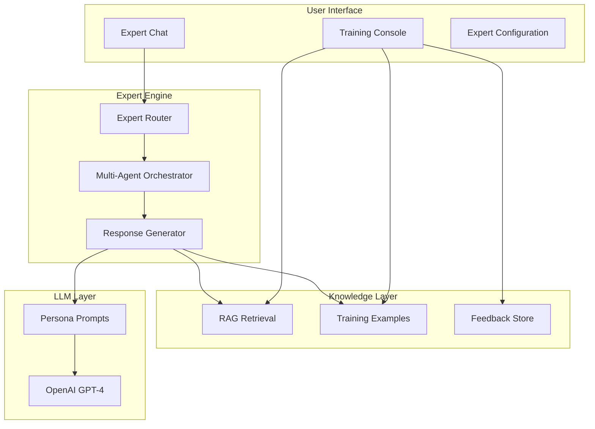

# AI Expert Agents System

## Overview

A multi-expert AI system where specialized agents (Medicinal Chemist, Computational Biologist, Clinical Scientist, Biostatistician) collaborate to support drug discovery decisions. Humans can train and refine these experts through feedback, examples, and knowledge base enhancement.

**Framework:** CrewAI (role-based multi-agent orchestration)

## Framework Selection

| Evaluated | Decision | Reason |
|-----------|----------|--------|
| OpenAI Swarm | ❌ Rejected | Experimental, not production-ready, no official support |
| CrewAI | ✅ Selected | Production-ready, role-based agents, hierarchical workflows, built-in memory |
| Custom | ❌ Rejected | More maintenance, reinventing patterns |

### CrewAI Integration

```python
# Installation
pip install crewai crewai-tools

# Core Concepts
from crewai import Agent, Task, Crew, Process

# Each domain expert becomes a CrewAI Agent
chemist = Agent(
    role="Medicinal Chemist",
    goal="Provide SAR analysis and lead optimization guidance",
    backstory="Dr. Chen is an expert medicinal chemist with 20 years experience...",
    llm=ChatOpenAI(model="gpt-4"),
    tools=[rag_search_tool, compound_lookup_tool],
    memory=True,  # Built-in conversation memory
    verbose=True
)

# Panel discussions use Crew with hierarchical process
crew = Crew(
    agents=[chemist, biologist, clinician, statistician],
    tasks=[analysis_task],
    process=Process.hierarchical,  # Manager coordinates responses
    manager_llm=ChatOpenAI(model="gpt-4")
)
```

### CrewAI Benefits
- **Role-based agents**: Natural fit for domain expert personas
- **Process types**: Sequential (single expert) or Hierarchical (panel)
- **Built-in memory**: Short-term and long-term memory management
- **Tool integration**: Easy RAG and platform data tool attachment
- **Delegation**: Agents can delegate sub-tasks to each other

## Architecture



## Database Models

New file: `amprenta_rag/models/experts.py`

| Model | Purpose |
|-------|---------|
| `ExpertAgent` | Persona definition (name, role, system_prompt, **prompt_version**, specializations, avatar) |
| `ExpertConversation` | Conversation thread (user_id, title, participants, context_entity, **max_messages=50**) |
| `ExpertMessage` | Message in conversation (role, content, expert_id, **prompt_version_used**, reasoning, citations, **token_count**) |
| `ExpertFeedback` | Human feedback (message_id, **rating 1-5**, correction, tags) |
| `ExpertTrainingExample` | Curated Q&A pairs (expert_id, question, ideal_answer, tags, **is_approved**, **prompt_version**) |
| `ExpertKnowledgeDoc` | RAG documents per expert (**namespace=expert_{id}**, content, embedding, source, **chunk_index**) |

### P1 FIX: Prompt Versioning
- `ExpertAgent.prompt_version` (string, e.g., "v1.2") - tracks current prompt version
- `ExpertMessage.prompt_version_used` (string) - records which version generated this response
- Training examples tied to prompt versions for A/B testing

## Expert Personas (MVP)

| Expert | Role | Specializations |
|--------|------|-----------------|
| **Dr. Chen** | Medicinal Chemist | SAR analysis, ADMET interpretation, lead optimization |
| **Dr. Patel** | Computational Biologist | Pathway analysis, target validation, multi-omics |
| **Dr. Williams** | Clinical Scientist | Trial design, biomarker strategy, patient selection |
| **Dr. Kim** | Biostatistician | Power analysis, dose-response, statistical rigor |

## Key Features

### 1. Expert Chat Interface
- Single expert or panel discussion mode
- Entity context injection (ask about specific compound, dataset, experiment)
- Citation of platform data in responses
- Reasoning transparency (show expert's thought process)
- "Ask another expert" for second opinions

### 2. Expert Capabilities
- **Answer Questions**: Domain-specific Q&A with RAG-enhanced knowledge
- **Review Work**: Critique SAR analyses, experimental designs, statistical approaches
- **Recommend**: Prioritize compounds, suggest next experiments, identify risks
- **Hypothesize**: Generate mechanistic hypotheses, propose target connections

### 3. Training Console
- **Feedback Review**: Browse responses with ratings, identify weak areas
- **Example Curation**: Add/edit ideal Q&A pairs per expert
- **Knowledge Upload**: Upload papers, SOPs, guidelines per expert domain
- **Fine-tune Export**: Export training data in JSONL format for model fine-tuning

### 4. Multi-Expert Collaboration (P1 FIX: Orchestration Strategy)

**Turn-Taking Strategy:** Sequential with synthesis
1. User question sent to all selected experts in parallel
2. Each expert generates independent response (Round 1)
3. Orchestrator synthesizes responses, identifies disagreements
4. If disagreements exist: experts see each other's responses (Round 2)
5. Final synthesis with consensus score and flagged disagreements

**Rounds:** 2 max (initial response + optional rebuttal)

**Consensus Algorithm:**
- Agreement threshold: 70% similarity in recommendations
- Below threshold: Flag as "Experts Disagree" with both viewpoints
- Confidence-weighted voting (experts can express uncertainty 0-1)

**Output Format:**
```json
{
  "consensus": "partial|full|none",
  "primary_recommendation": "...",
  "expert_responses": [...],
  "disagreements": [{"topic": "...", "positions": [...]}],
  "confidence_score": 0.85
}
```

## API Endpoints

Router: `amprenta_rag/api/routers/experts.py`

| Endpoint | Method | Purpose |
|----------|--------|---------|
| `/experts` | GET | List available expert agents |
| `/experts/{id}` | GET | Get expert details + stats |
| `/experts/{id}` | PUT | Update expert configuration |
| `/experts/conversations` | GET | List user's conversations |
| `/experts/conversations` | POST | Start new conversation |
| `/experts/conversations/{id}/messages` | POST | Send message, get response |
| `/experts/conversations/{id}/panel` | POST | Get multi-expert panel response |
| `/experts/feedback` | POST | Submit feedback on message |
| `/experts/feedback` | GET | List feedback (admin) |
| `/experts/training/examples` | GET/POST | Manage training examples |
| `/experts/training/knowledge` | POST | Upload knowledge document |
| `/experts/training/export` | GET | Export fine-tuning dataset |

## Dashboard Pages

### Page 1: Expert Chat (`scripts/dashboard/pages/expert_chat.py`)
- 3-column layout: Expert selector | Chat | Context panel
- Expert cards with avatar, name, specialization
- Chat interface with markdown rendering
- Entity picker for context (compound, dataset, experiment)
- "Consult Panel" button for multi-expert mode

### Page 2: Training Console (`scripts/dashboard/pages/expert_training.py`)
- 4 tabs: Feedback Review | Training Examples | Knowledge Base | Export
- Feedback tab: Filter by expert, rating, date; bulk approve/reject
- Examples tab: CRUD for Q&A pairs with expert assignment
- Knowledge tab: Document upload with chunking preview
- Export tab: Generate JSONL for fine-tuning

### Page 3: Expert Configuration (`scripts/dashboard/pages/expert_config.py`)
- Admin-only page
- Edit expert personas (system prompts, specializations)
- Create custom experts
- View expert performance metrics

## Service Layer

File: `amprenta_rag/services/expert_agents.py`

### CrewAI Integration

```python
from crewai import Agent, Task, Crew, Process
from crewai_tools import tool

# Custom tools for platform data access
@tool("Search compound database")
def compound_search(query: str) -> str:
    """Search for compounds in the platform database."""
    # Integration with existing compound service
    pass

@tool("RAG knowledge search")  
def rag_search(query: str, expert_namespace: str) -> str:
    """Search expert-specific knowledge base."""
    # Integration with pgvector
    pass

# Agent factory
def create_expert_agent(expert: ExpertAgent) -> Agent:
    """Create CrewAI agent from database ExpertAgent."""
    return Agent(
        role=expert.role,
        goal=f"Provide expert {expert.role} guidance",
        backstory=expert.system_prompt,
        tools=[compound_search, rag_search],
        memory=True,
        verbose=True
    )
```

### Key Functions
- `get_expert_response()` - Single expert via CrewAI sequential process
- `get_panel_response()` - Multi-expert via CrewAI hierarchical process  
- `create_expert_crew()` - Build Crew from selected experts
- `inject_entity_context()` - Load platform data as task context
- `record_feedback()` - Store feedback for training
- `retrieve_expert_knowledge()` - RAG retrieval scoped to expert domain
- `export_training_data()` - Generate fine-tuning JSONL

## Implementation Batches

| Batch | Content | Effort |
|-------|---------|--------|
| 1 | Database models + migration | 30 min | ✅ DONE |
| 2 | CrewAI integration + service layer | 45 min |
| 3 | Chat API endpoints (8 endpoints) | 30 min |
| 4 | Training API endpoints (4 endpoints) | 20 min |
| 5 | Expert Chat dashboard | 40 min |
| 6 | Training Console dashboard | 35 min |
| 7 | Tests (40+ tests) | 30 min |

**Total: ~4 hours**

## Dependencies

Add to `requirements.txt`:
```
crewai==0.30.0      # Pin exact version - breaking changes in 0.x releases
crewai-tools==0.2.0  # Pin exact version
```

**Version Policy:** Test all CrewAI upgrades in staging before production. Breaking API changes common in 0.x versions.

## Memory Strategy (P1 FIX)

**Dual-memory approach (Option B):**
- **CrewAI memory**: Short-term session context (within conversation)
- **Database tables**: Long-term persistence (history, training, analytics)

```python
# After each CrewAI response, persist to DB
def save_conversation_to_db(crew_result, conversation_id, db):
    """Persist CrewAI output to ExpertMessage table."""
    message = ExpertMessage(
        conversation_id=conversation_id,
        expert_id=crew_result.agent_id,
        role="assistant",
        content=crew_result.output,
        prompt_version_used=expert.prompt_version,
        token_count=estimate_tokens(crew_result)
    )
    db.add(message)
    db.commit()

# Load conversation history into CrewAI task context
def load_history_for_crew(conversation_id, db, limit=10):
    """Load recent messages as context for new tasks."""
    messages = db.query(ExpertMessage).filter(...).limit(limit).all()
    return "\n".join([f"{m.role}: {m.content}" for m in messages])
```

**Flow:**
1. User sends message → Save to ExpertMessage (role="user")
2. Load recent history → Inject into CrewAI Task context
3. CrewAI processes with its memory → Generate response
4. Save response → ExpertMessage (role="assistant")
5. Training/feedback reference DB, not CrewAI memory

## Tool Definitions (P1 FIX)

```python
from crewai_tools import BaseTool
from pydantic import Field

class CompoundLookupTool(BaseTool):
    """Look up compound details from platform database."""
    name: str = "compound_lookup"
    description: str = "Look up compound by ID or SMILES. Returns structure, properties, and activity data."
    
    def _run(self, query: str) -> str:
        from amprenta_rag.database.session import db_session
        from amprenta_rag.database.models import Compound
        
        with db_session() as db:
            compound = db.query(Compound).filter(
                (Compound.compound_id == query) | (Compound.smiles == query)
            ).first()
            
            if not compound:
                return f"No compound found for: {query}"
            
            return f"""
Compound: {compound.compound_id}
SMILES: {compound.smiles}
MW: {compound.mw or 'N/A'}
LogP: {compound.logp or 'N/A'}
"""


class RAGSearchTool(BaseTool):
    """Search expert-specific knowledge base."""
    name: str = "rag_search"
    description: str = "Search the expert's knowledge base for relevant information."
    expert_id: str = Field(default="")
    
    def _run(self, query: str) -> str:
        from amprenta_rag.services.expert_agents import retrieve_expert_knowledge
        from amprenta_rag.database.session import db_session
        
        with db_session() as db:
            docs = retrieve_expert_knowledge(db, self.expert_id, query, k=3)
            if not docs:
                return "No relevant knowledge found."
            return "\n\n".join([d.content for d in docs])


class DatasetInfoTool(BaseTool):
    """Get information about a dataset."""
    name: str = "dataset_info"
    description: str = "Look up dataset details including description, features, and statistics."
    
    def _run(self, dataset_id: str) -> str:
        # Implementation similar to compound lookup
        pass


class ExperimentInfoTool(BaseTool):
    """Get information about an experiment."""
    name: str = "experiment_info"
    description: str = "Look up experiment details including protocol, results, and status."
    
    def _run(self, experiment_id: str) -> str:
        # Implementation similar to compound lookup
        pass
```

## Integration Points

- **Existing RAG**: Reuse `amprenta_rag/query/rag/` for retrieval
- **Existing LLM**: Reuse OpenAI client in `amprenta_rag/utils/llm.py`
- **Entity Context**: Load compounds, datasets, experiments for context injection
- **Activity Feed**: Log expert consultations as activity events

### P1 FIX: RAG Isolation Strategy

**Approach:** Single pgvector store with namespace metadata filtering

```python
# ExpertKnowledgeDoc stores embeddings with namespace
namespace = f"expert_{expert_id}"  # e.g., "expert_chemist", "expert_biologist"

# Retrieval query filters by namespace
results = db.query(ExpertKnowledgeDoc).filter(
    ExpertKnowledgeDoc.namespace == namespace,
    ExpertKnowledgeDoc.embedding.cosine_distance(query_embedding) < threshold
).limit(k)
```

**Chunking Strategy:**
- Chunk size: 1000 tokens with 200 token overlap
- Store chunk_index for document reconstruction
- Preserve section headers in chunks

**Embedding Model:** text-embedding-3-small (tracked in ExpertKnowledgeDoc.embedding_model)

**Fallback:** If expert-specific knowledge insufficient, query general platform RAG with lower weight

## Future Enhancements (P2)

### Inter-Agent Communication (P2)
- **True dialogue mode**: Experts discuss amongst themselves before final answer
- **Expert-to-expert questions**: "Dr. Chen, can you explain the SAR implications?"
- **Debate mode**: Forced disagreement exploration to surface edge cases
- **Consensus-building rounds**: Iterative refinement until agreement threshold met
- **Agent orchestration patterns**: Sequential, parallel, hierarchical, democratic

### Technical/Platform Agents (P2)
- **Tech Architect Agent**: System design, feature architecture, integration patterns
- **Data Engineer Agent**: Data pipeline design, ingestion strategies, schema recommendations
- **UX Designer Agent**: User experience guidance, interface patterns, accessibility
- **QA Lead Agent**: Testing strategy, coverage recommendations, edge case identification
- **DevOps Agent**: Deployment, infrastructure, monitoring recommendations

These "meta-agents" would help build the platform itself, not just support drug discovery.

### Other P2 Items
- Voice input/output for hands-free lab consultation
- Expert memory (remember past conversations per user)
- Automated feedback from outcome data (was recommendation successful?)
- Custom expert creation wizard
- Expert benchmarking against human expert panels
- Integration with external knowledge APIs (PubMed, ChEMBL)

## Success Criteria

1. Users can chat with 4 domain experts
2. Experts cite platform data in responses
3. Multi-expert panel discussions work
4. Feedback collection functional
5. Training examples manageable
6. Knowledge documents uploadable
7. Fine-tuning export works
8. 40+ tests passing

