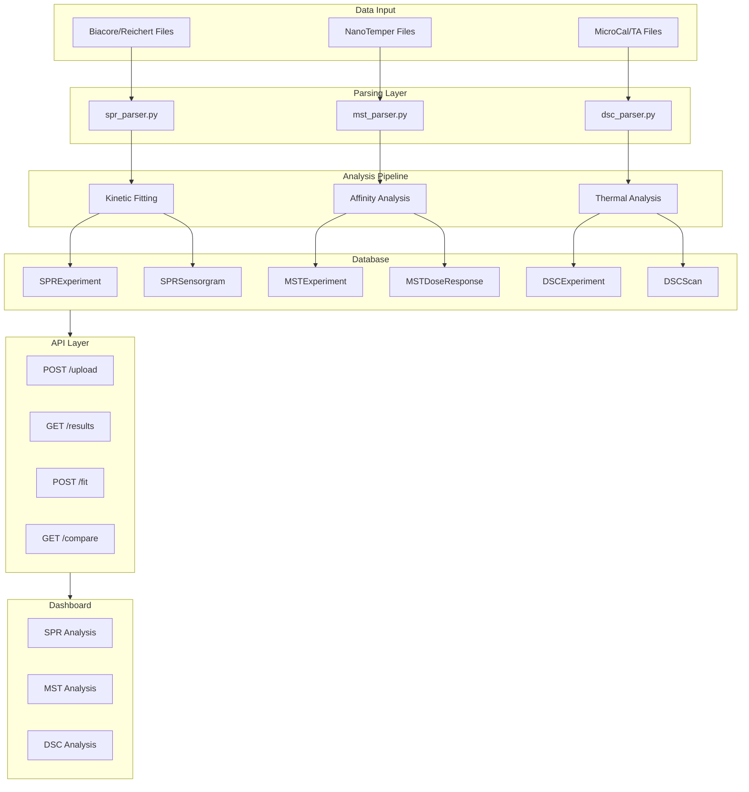

# Biophysical Assay Support (SPR, MST, DSC)

**Status:** Approved with changes (Reviewer feedback incorporated)
**Created:** 2025-12-30
**Estimated Duration:** 5-7 days

## Overview

Implement comprehensive biophysical assay data ingestion and analysis for SPR (Surface Plasmon Resonance), MST (MicroScale Thermophoresis), and DSC (Differential Scanning Calorimetry).

## Reviewer Feedback (Incorporated)

### P0/P1 Fixes Applied
1. **Compound FK** - Added `compound_id` to all experiment models
2. **Target FK** - Added `target_id` and `target_name` fields
3. **Units columns** - Added `response_units`, `concentration_units`
4. **ARRAY validation** - Documented 50K point limit

### P2 Additions
1. Experiment type enum for SPR (kinetics, affinity, screening)
2. Buffer/conditions columns (buffer_composition, temperature)
3. Replicate tracking (replicate_number, replicate_group_id)
4. Quality metrics per assay type

---

## Architecture



---

## Batch 1: Database Schema (Day 1)

**Files to create:**
- `amprenta_rag/database/models_biophysical.py`

**Models (with P0/P1 fixes):**

### SPR Models
```python
class SPRExperimentType(str, Enum):
    KINETICS = "kinetics"      # Full ka/kd determination
    AFFINITY = "affinity"      # Steady-state KD only
    SCREENING = "screening"    # Yes/no binding

class SPRExperiment(Base):
    """SPR experiment metadata."""
    __tablename__ = "spr_experiments"
    
    id: UUID (PK)
    experiment_id: UUID (FK to experiments.id, nullable)
    
    # P0/P1 FIX: Compound and Target linking
    compound_id: UUID (FK to compounds.id, nullable, index=True)
    target_id: UUID (FK to protein_structures.id, nullable, index=True)
    target_name: String(200)  # Fallback if no structure
    
    # Experiment metadata
    experiment_type: String(50)  # P2: kinetics/affinity/screening
    instrument: String(100)  # Biacore T200, Reichert, Octet
    chip_type: String(100)  # CM5, NTA, Streptavidin
    immobilization_method: String(100)  # Amine, His-tag, Biotin
    
    # P2: Conditions
    buffer_composition: String(500)  # "HBS-EP+ pH 7.4"
    temperature_celsius: Float
    
    # P0/P1 FIX: Units
    response_units: String(50, default="RU")  # RU, nm, pm
    concentration_units: String(20, default="nM")
    
    # Fitted kinetic parameters
    ka: Float  # Association rate (1/Ms)
    kd_rate: Float  # Dissociation rate (1/s)
    kd_affinity: Float  # Equilibrium dissociation constant (M)
    rmax: Float  # Maximum response
    chi_squared: Float  # Fit quality
    fit_model: String(50)  # 1:1 Langmuir, two-state
    
    # P2: Quality metrics
    u_value: Float  # Uniqueness of fit
    mass_transport_limited: Boolean
    
    # P2: Replicates
    replicate_number: Integer(default=1)
    replicate_group_id: UUID(nullable)
    
    processing_status: String(50)  # pending/processing/completed/failed
    raw_file_path: String(500)
    created_at: DateTime
    created_by_id: UUID (FK to users.id)

class SPRSensorgram(Base):
    """SPR sensorgram data points (max 50,000 points)."""
    __tablename__ = "spr_sensorgrams"
    
    id: UUID (PK)
    spr_experiment_id: UUID (FK)
    cycle_number: Integer
    analyte_concentration: Float
    
    # P0/P1 FIX: Document 50K limit
    time_seconds: ARRAY(Float)  # Max 50,000 points
    response_values: ARRAY(Float)  # Max 50,000 points
    
    association_start: Float
    dissociation_start: Float
    baseline_response: Float
```

### MST Models
```python
class MSTExperiment(Base):
    """MST experiment metadata."""
    __tablename__ = "mst_experiments"
    
    id: UUID (PK)
    experiment_id: UUID (FK, nullable)
    
    # P0/P1 FIX: Compound and Target
    compound_id: UUID (FK, nullable, index=True)
    target_id: UUID (FK, nullable, index=True)
    target_name: String(200)
    
    instrument: String(100)  # Monolith NT.115, NT.Automated
    capillary_type: String(100)  # Standard, Premium, LabelFree
    excitation_power: Float  # LED %
    mst_power: Float  # IR laser %
    
    # P2: Conditions
    buffer_composition: String(500)
    temperature_celsius: Float
    
    # P0/P1 FIX: Units
    concentration_units: String(20, default="nM")
    
    # Fitted affinity
    kd_affinity: Float  # M
    kd_error: Float
    hill_coefficient: Float
    amplitude: Float
    baseline: Float
    fit_quality: Float  # R-squared
    
    # P2: Quality metrics
    aggregation_detected: Boolean
    photobleaching_percent: Float
    signal_to_noise: Float
    
    # P2: Replicates
    replicate_number: Integer(default=1)
    replicate_group_id: UUID(nullable)
    
    processing_status: String(50)
    raw_file_path: String(500)
    created_at: DateTime

class MSTDoseResponse(Base):
    """MST dose-response data points."""
    __tablename__ = "mst_dose_responses"
    
    id: UUID (PK)
    mst_experiment_id: UUID (FK)
    concentration: Float
    fnorm: Float  # Normalized fluorescence
    fnorm_error: Float
    cold_region_mean: Float
    hot_region_mean: Float
```

### DSC Models
```python
class DSCExperiment(Base):
    """DSC experiment metadata."""
    __tablename__ = "dsc_experiments"
    
    id: UUID (PK)
    experiment_id: UUID (FK, nullable)
    
    # P0/P1 FIX: Compound (ligand effect) and Protein
    compound_id: UUID (FK, nullable, index=True)  # Compound affecting stability
    protein_id: UUID (FK to protein_structures.id, nullable, index=True)
    protein_name: String(200)
    
    instrument: String(100)  # MicroCal VP-DSC, TA Nano DSC
    concentration_mg_ml: Float
    scan_rate_celsius_min: Float
    
    # P2: Conditions
    buffer_composition: String(500)
    ph: Float
    
    # Fitted thermal parameters
    tm_celsius: Float  # Melting temperature
    tm_error: Float
    delta_h_kcal_mol: Float  # Enthalpy
    delta_cp_kcal_mol_k: Float  # Heat capacity change
    onset_celsius: Float
    fit_model: String(50)  # two-state, non-two-state
    
    # P2: Quality metrics
    baseline_quality_score: Float
    reversibility_percent: Float
    
    # P2: Replicates
    replicate_number: Integer(default=1)
    replicate_group_id: UUID(nullable)
    
    processing_status: String(50)
    raw_file_path: String(500)
    created_at: DateTime

class DSCScan(Base):
    """DSC thermogram data points (max 50,000 points)."""
    __tablename__ = "dsc_scans"
    
    id: UUID (PK)
    dsc_experiment_id: UUID (FK)
    scan_number: Integer  # For reversibility tests
    
    # P0/P1 FIX: Document 50K limit
    temperature_celsius: ARRAY(Float)  # Max 50,000 points
    cp_kcal_mol_k: ARRAY(Float)  # Heat capacity
    
    baseline_subtracted: Boolean
    is_rescan: Boolean  # For reversibility
```

**Alembic migration:** Create 6 tables with proper indexes and constraints.

**Tests:** 12 unit tests.

---

## Batch 2: File Parsers (Day 2)

**Files to create:**
- `amprenta_rag/biophysical/__init__.py`
- `amprenta_rag/biophysical/spr_parser.py`
- `amprenta_rag/biophysical/mst_parser.py`
- `amprenta_rag/biophysical/dsc_parser.py`

**SPR Parser:**
```python
def parse_biacore_csv(path: str) -> SPRData
def parse_biacore_bia(path: str) -> SPRData  # Binary format
def parse_reichert(path: str) -> SPRData
def extract_sensorgrams(data: SPRData) -> List[Sensorgram]
def detect_injection_phases(time: np.ndarray, response: np.ndarray) -> Phases
def validate_array_size(arr: np.ndarray, max_points: int = 50000) -> None
```

**MST Parser:**
```python
def parse_nanotemper_moc(path: str) -> MSTData
def parse_mst_excel(path: str) -> MSTData
def extract_dose_response(data: MSTData) -> DoseResponse
def calculate_fnorm(cold: np.ndarray, hot: np.ndarray) -> float
```

**DSC Parser:**
```python
def parse_microcal_origin(path: str) -> DSCData
def parse_ta_instruments_csv(path: str) -> DSCData
def baseline_correction(temp: np.ndarray, cp: np.ndarray) -> np.ndarray
```

**Tests:** 15 parser tests.

---

## Batch 3: Analysis Pipelines (Day 3)

**Files to create:**
- `amprenta_rag/biophysical/spr_analysis.py`
- `amprenta_rag/biophysical/mst_analysis.py`
- `amprenta_rag/biophysical/dsc_analysis.py`

**SPR Analysis (using lmfit):**
```python
def fit_1_to_1_langmuir(sensorgram: Sensorgram) -> KineticFit
def fit_two_state(sensorgram: Sensorgram) -> KineticFit
def global_fit(sensorgrams: List[Sensorgram], model: str) -> GlobalFit
def calculate_kd_from_kinetics(ka: float, kd: float) -> float
def calculate_kd_from_steady_state(concs: np.ndarray, responses: np.ndarray) -> float
def assess_mass_transport(fit: KineticFit) -> bool
```

**MST Analysis:**
```python
def fit_dose_response(concentrations: np.ndarray, fnorm: np.ndarray) -> AffinityFit
def calculate_kd_hill(concs: np.ndarray, response: np.ndarray) -> Tuple[float, float, float]
def quality_check(fit: AffinityFit) -> QualityMetrics
def detect_aggregation(fnorm_values: np.ndarray) -> bool
```

**DSC Analysis:**
```python
def fit_two_state_unfolding(temp: np.ndarray, cp: np.ndarray) -> ThermalFit
def detect_peaks(temp: np.ndarray, cp: np.ndarray) -> List[Peak]
def calculate_reversibility(scan1: DSCScan, scan2: DSCScan) -> float
def deconvolute_transitions(temp: np.ndarray, cp: np.ndarray, n_peaks: int) -> List[ThermalFit]
```

**Tests:** 15 analysis tests.

---

## Batch 4: Ingest Service (Day 4)

**Files to create:**
- `amprenta_rag/biophysical/ingest_service.py`

**Functions:**
```python
def ingest_spr_file(
    path: str, 
    experiment_id: UUID = None,
    compound_id: UUID = None,
    target_id: UUID = None
) -> SPRExperiment

def ingest_mst_file(
    path: str,
    experiment_id: UUID = None,
    compound_id: UUID = None,
    target_id: UUID = None
) -> MSTExperiment

def ingest_dsc_file(
    path: str,
    experiment_id: UUID = None,
    compound_id: UUID = None,
    protein_id: UUID = None
) -> DSCExperiment

def _process_spr_async(spr_id: UUID) -> None
def _process_mst_async(mst_id: UUID) -> None
def _process_dsc_async(dsc_id: UUID) -> None

def link_to_compound(result_id: UUID, compound_id: UUID, assay_type: str) -> None
def link_to_target(result_id: UUID, target_id: UUID, assay_type: str) -> None
```

**Tests:** 10 integration tests.

---

## Batch 5: API Endpoints (Day 5)

**Files to create:**
- `amprenta_rag/api/routers/biophysical.py`
- `amprenta_rag/api/schemas/biophysical.py`

**Endpoints (12 total):**

| Method | Path | Description |
|--------|------|-------------|
| POST | `/api/v1/biophysical/spr/upload` | Upload SPR file |
| GET | `/api/v1/biophysical/spr` | List SPR experiments |
| GET | `/api/v1/biophysical/spr/{id}` | Get SPR details + sensorgrams |
| POST | `/api/v1/biophysical/spr/{id}/fit` | Refit kinetics |
| POST | `/api/v1/biophysical/mst/upload` | Upload MST file |
| GET | `/api/v1/biophysical/mst` | List MST experiments |
| GET | `/api/v1/biophysical/mst/{id}` | Get MST details + dose-response |
| POST | `/api/v1/biophysical/mst/{id}/fit` | Refit affinity |
| POST | `/api/v1/biophysical/dsc/upload` | Upload DSC file |
| GET | `/api/v1/biophysical/dsc` | List DSC experiments |
| GET | `/api/v1/biophysical/dsc/{id}` | Get DSC details + thermogram |
| GET | `/api/v1/biophysical/compare` | Compare results across assays |

**Tests:** 12 API tests.

---

## Batch 6: Dashboard UI (Days 6-7)

**Files to create:**
- `scripts/dashboard/pages/biophysical_assays.py`

**3-Tab Dashboard:**

### Tab 1: SPR Analysis
- Upload Biacore/Reichert files
- Compound/Target selector dropdowns
- Sensorgram visualization (Plotly)
- Kinetic parameter table (ka, kd, KD, Rmax, χ²)
- Global fit controls
- Steady-state analysis toggle
- Quality metrics display
- Export fitted parameters

### Tab 2: MST Analysis
- Upload NanoTemper files
- Compound/Target selector
- Dose-response curve visualization
- KD fitting with Hill equation
- Quality metrics (aggregation, S/N)
- Compare multiple experiments
- Export binding data

### Tab 3: DSC Analysis
- Upload MicroCal/TA files
- Protein/Compound selector
- Thermogram visualization
- Tm peak detection
- Multi-transition deconvolution
- Reversibility analysis (scan overlay)
- Export thermal parameters

**Register page in navigation.py** under "Analysis" category.

**Tests:** 10 E2E tests.

---

## Batch 7: Integration & Documentation (Day 8)

**Tasks:**
1. Verify compound/target linking works end-to-end
2. Create seed script: `scripts/seed_biophysical_data.py`
3. Documentation: `docs/BIOPHYSICAL_ASSAYS.md`
4. Update ROADMAP.md

**Tests:** 6 integration tests.

---

## Dependencies

Add to `requirements.txt`:
```
lmfit>=1.2.0  # Nonlinear curve fitting for kinetics/affinity
```

---

## Deferred Items (P3)

- BLI/Octet support (similar SPR but different format)
- ITC support (thermal binding)
- Cross-assay correlation dashboard
- Automated report generation

---

## Summary

| Batch | Deliverable | Tests |
|-------|-------------|-------|
| 1 | Database Schema (6 models) | 12 |
| 2 | File Parsers (SPR, MST, DSC) | 15 |
| 3 | Analysis Pipelines | 15 |
| 4 | Ingest Service | 10 |
| 5 | API Endpoints (12) | 12 |
| 6 | Dashboard UI (3-tab) | 10 |
| 7 | Integration & Docs | 6 |
| **Total** | | **80 tests** |

**Estimated Duration:** 5-7 days
**Test Coverage Target:** 100% pass rate, zero skipped tests

