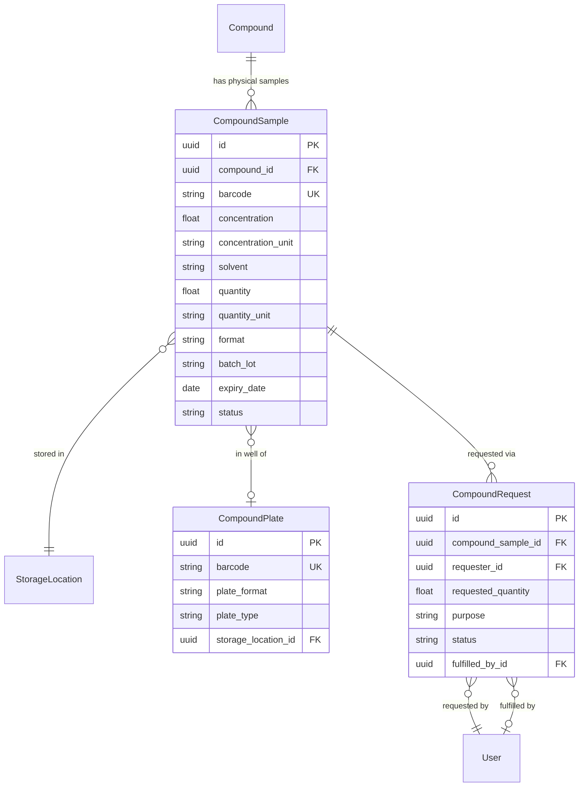

# Compound Inventory System

## Overview

Physical compound sample tracking system connecting digital compound records to wet lab inventory. Scientists can request compounds; inventory managers fulfill orders. Builds on existing `StorageLocation` and `Sample` infrastructure.

## Architecture



## Key Files

| Component | File |
|-----------|------|
| Models | [`amprenta_rag/models/inventory.py`](amprenta_rag/models/inventory.py) (new) |
| Service | [`amprenta_rag/services/inventory.py`](amprenta_rag/services/inventory.py) (new) |
| API Router | [`amprenta_rag/api/routers/inventory.py`](amprenta_rag/api/routers/inventory.py) (new) |
| Schemas | [`amprenta_rag/api/schemas.py`](amprenta_rag/api/schemas.py) (extend) |
| Dashboard | [`scripts/dashboard/pages/compound_inventory.py`](scripts/dashboard/pages/compound_inventory.py) (new) |
| Migration | `alembic/versions/xxx_add_compound_inventory.py` |

## Batches

### Batch 1: Database Models and Migration

**P1 FIX APPLIED:** Extend existing `Sample` model instead of creating separate `CompoundSample` (avoids schema duplication, reuses `SampleTransfer` audit trail).

**1. Extend `Sample` model** in `amprenta_rag/models/sample.py`:

Add compound-specific fields:
- `compound_id` FK to Compound (nullable - only for compound samples)
- `concentration` Float (nullable)
- `concentration_unit` String(20) (e.g., mM, µM)
- `solvent` String(50) (DMSO, water, etc.)
- `format` String(20) (tube, vial, plate_well)
- `batch_lot` String(100) (batch/lot tracking)
- `expiry_date` Date (nullable)
- `plate_id` FK to CompoundPlate (nullable, for plated compounds)
- `well_position` String(10) (e.g., A01, for plated compounds)

Use `sample_type = 'compound'` to distinguish from biological samples.

**2. Create `CompoundPlate`** in `amprenta_rag/models/inventory.py`:
- `id` UUID PK
- `barcode` String(200), unique, indexed
- `plate_format` String(20) - 96, 384, 1536
- `plate_type` String(50) - mother, daughter, screening
- `storage_location_id` FK to StorageLocation
- `status` String(20) - active, archived, empty (P1 FIX)
- `created_at` DateTime
- `created_by_id` FK to User (P1 FIX)

**3. Create `CompoundRequest`** in `amprenta_rag/models/inventory.py`:
- `id` UUID PK
- `sample_id` FK to Sample (nullable - can request by compound)
- `compound_id` FK to Compound (for requests by compound)
- `requester_id` FK to User
- `requested_quantity` Float
- `quantity_unit` String(20)
- `purpose` String(100) - screening, assay, synthesis
- `priority` String(20) - low, normal, high, urgent
- `status` String(20) - requested, approved, fulfilled, cancelled, rejected
- `requested_at` DateTime (P1 FIX)
- `approved_at` DateTime (P1 FIX)
- `approved_by_id` FK to User (P1 FIX)
- `fulfilled_by_id` FK to User
- `fulfilled_at` DateTime
- `rejection_reason` Text (P1 FIX)
- `notes` Text

Generate Alembic migration.

### Batch 2: Service Layer

Create `amprenta_rag/services/inventory.py` with functions:

**Compound Sample CRUD (uses extended Sample model):**
- `create_compound_sample()` - Register new tube/vial
  - **P1 FIX:** Check barcode uniqueness before creation
  - Sets `sample_type='compound'`
- `get_compound_sample()` - By ID or barcode
- `list_compound_samples()` - With filters (compound, status, location, low_stock, expiring)
- `update_compound_sample()` - Update quantity, status, location
- `transfer_compound_sample()` - Move to new location (uses existing `SampleTransfer` model)
- `deplete_compound_sample()` - Mark as depleted after use

**CompoundPlate:**
- `create_compound_plate()` - Register plate with well mapping
- `get_plate_contents()` - List compounds in plate wells
- `list_plates()` - With filters (status, location)

**Request Workflow:**
- `create_request()` - Scientist requests compound
- `approve_request()` - Inventory manager approves (sets `approved_at`, `approved_by_id`)
- `fulfill_request()` - Mark fulfilled, deduct quantity
  - **P1 FIX:** Validate `sample.quantity >= request.requested_quantity`
  - Auto-set `status='depleted'` if quantity reaches 0
- `reject_request()` - With `rejection_reason`
- `list_pending_requests()` - For inventory dashboard

**Barcode Operations:**
- `lookup_barcode()` - Unified lookup (sample or plate)
- `generate_barcode()` - Auto-generate unique barcode (format: `COMP-YYYYMMDD-XXXXXX`)

**Alert Queries (for dashboard):**
- `get_low_stock_samples()` - Samples below threshold (default 100µL)
- `get_expiring_samples()` - Samples expiring within N days (default 30)
- `get_expired_samples()` - Samples past expiry_date

### Batch 3: API Endpoints

Create `amprenta_rag/api/routers/inventory.py`:

**CompoundSample endpoints (8):**
- `POST /samples` - Register compound sample
- `GET /samples` - List with filters
- `GET /samples/{id}` - Get by ID
- `GET /samples/barcode/{barcode}` - Lookup by barcode
- `PUT /samples/{id}` - Update
- `POST /samples/{id}/transfer` - Transfer to location
- `POST /samples/{id}/dispense` - Record dispensing (deduct quantity)
- `DELETE /samples/{id}` - Soft delete (set status=archived)

**CompoundPlate endpoints (4):**
- `POST /plates` - Create plate
- `GET /plates` - List plates
- `GET /plates/{id}` - Get plate with well contents
- `GET /plates/barcode/{barcode}` - Lookup

**Request endpoints (5):**
- `POST /requests` - Create request
- `GET /requests` - List (filter by status, requester)
- `GET /requests/{id}` - Get request details
- `PUT /requests/{id}/approve` - Approve
- `PUT /requests/{id}/fulfill` - Fulfill
- `PUT /requests/{id}/reject` - Reject

Add schemas to `amprenta_rag/api/schemas.py`.

### Batch 4: Dashboard UI

Create `scripts/dashboard/pages/compound_inventory.py` with 5 tabs:

1. **Compound Stocks** - Browse all compound samples
   - Search by compound ID, barcode, or name
   - Filter by status, location, expiry
   - **P1 FIX: Alert indicators:**
     - 🔴 Low Stock badge (quantity < 100µL)
     - ⚠️ Expiring Soon badge (< 30 days)
     - ❌ Expired badge
   - Quick filter buttons: "Low Stock", "Expiring Soon", "Expired"
   - Quick actions: view, transfer, dispense

2. **Plates** - Plate management
   - List plates with barcode/type/location
   - Plate viewer (96/384 grid with well contents)
   - Create new plate with well assignment

3. **Register Sample** - Add new compound to inventory
   - Select compound (autocomplete by ID/SMILES)
   - Enter concentration, solvent, quantity
   - Assign barcode (auto or manual)
   - Set storage location

4. **Requests** - Request/fulfillment workflow
   - For scientists: Create request form
   - For admins: Pending requests queue with approve/fulfill/reject
   - Show rejection reason for rejected requests

5. **Transfer Log** - Audit trail of movements (uses existing SampleTransfer)
   - Filter by date, sample, user
   - Export to CSV

Register in PAGE_REGISTRY under Chemistry category.

### Batch 5: Tests and Documentation

**Unit Tests (15):** - P1 FIX: Added 3 edge case tests
- `test_inventory_models.py` - Model validation (4 tests)
- `test_inventory_service.py` - Service functions (11 tests):
  - CRUD operations (6 tests)
  - **P1 FIX: test_fulfill_request_insufficient_quantity** - Validates error on insufficient stock
  - **P1 FIX: test_create_sample_duplicate_barcode** - Validates barcode uniqueness check
  - **P1 FIX: test_transfer_creates_audit_record** - Validates SampleTransfer audit trail
  - Alert queries (2 tests: low stock, expiring)

**API Tests (10):**
- `test_inventory_api.py` - All endpoints

**E2E Tests (6):**
- `test_compound_inventory_e2e.py` - Dashboard flows
  - Register compound sample
  - Barcode lookup
  - Create/fulfill request
  - Transfer sample
  - Plate viewer
  - Low stock alert display

Total: 31 tests

## Verification

After each batch:
```bash
cd /Users/bard/Documents/RAG && conda activate myenv
pytest amprenta_rag/tests/... -v --tb=short
```

Final E2E:
```bash
pytest amprenta_rag/tests/e2e/test_compound_inventory_e2e.py -v --headed
```

