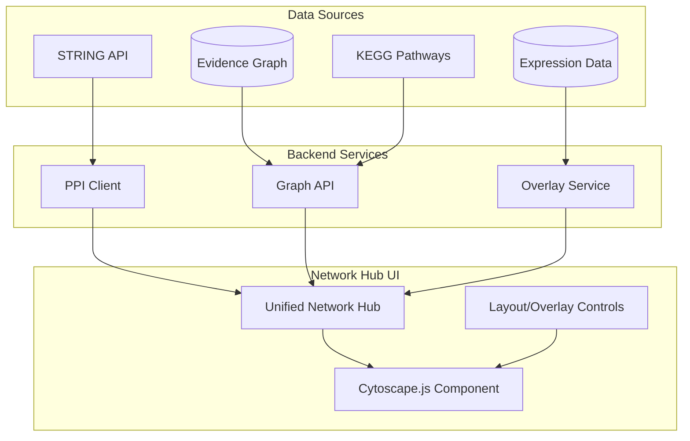

# Cytoscape.js Network Hub

Unified network visualization platform integrating PPI data, graph exploration, and expression overlays.

## Architecture



## Implementation Batches

### Batch 1: STRING API Client (PPI Data)
Create client for fetching protein-protein interactions from STRING database.

**New file**: `amprenta_rag/connectivity/string_client.py`
- `resolve_gene_symbols(symbols: list) -> dict[str, str]` - gene symbol → STRING ID
- `get_interactions(proteins: list[str], species: int = 9606, min_score: float = 0.4)` - fetch PPI network
- `get_interaction_partners(protein: str, limit: int = 50)` - single protein neighbors
- `get_enrichment(proteins: list[str])` - functional enrichment
- Rate limiting (1 req/sec) + caching + retry with exponential backoff

**New endpoints** in `amprenta_rag/api/routers/graph.py`:
- `GET /graph/ppi/{gene_symbol}` - PPI network for a gene
- `POST /graph/ppi/network` - PPI network for gene list (with species + min_score params)

### Batch 2: Enhanced Cytoscape Component
Upgrade the base component with cluster highlighting and expression overlay.

**Modify**: `scripts/dashboard/components/cytoscape.py`
- Add `node_colors: dict` parameter for expression overlay
- Add `communities: dict` parameter for cluster coloring
- Add `edge_data: bool` parameter for edge labels/weights
- Add color legend rendering (expression scale + community colors)
- Add cluster highlighting on hover
- Diverging colormap for expression (blue-white-red)
- Add zoom controls (in/out buttons)

### Batch 3: Expression Overlay Service
Generalize expression overlay from pathway viewer to all networks.

**New file**: `amprenta_rag/services/expression_overlay.py`
- `get_expression_for_genes(gene_symbols: list, dataset_id: UUID)` - fetch log2FC
- `compute_node_colors(expression: dict, colormap: str)` - map values to colors
- Support for multiple colormaps (diverging, sequential)

**New endpoint**: `POST /api/v1/datasets/{id}/expression-overlay`

### Batch 4: Unified Network Hub Page
Single dashboard page combining all network types. **Replaces Graph Explorer.**

**New file**: `scripts/dashboard/pages/network_hub.py`

Tabs:
1. **PPI Explorer** - Gene input, STRING network, species selector, confidence filter
2. **Evidence Graph** - Full Graph Explorer functionality (see feature parity below)
3. **Compound-Target** - Drug network visualization
4. **Pathway Networks** - Link to existing pathway viewer

Features:
- Network type selector
- Unified layout controls (cose, concentric, circle, grid)
- Expression overlay toggle with dataset selector
- Cluster detection toggle with community colors
- Node search/filter for large networks
- Export to PNG/JSON

### Batch 5: Graph Explorer Migration → Network Hub Evidence Tab
Migrate all Graph Explorer functionality to Network Hub's "Evidence Graph" tab.

**Delete after migration**: `scripts/dashboard/pages/graph_explorer.py`
**Update**: Navigation menu to point to Network Hub

**Feature Parity Checklist (P1 Fix #1):**
- [ ] Entity type + ID input (preserve deep-link: `?entity_type=...&entity_id=...`)
- [ ] Traversal mode with depth slider and maxNodes control
- [ ] Shortest path mode with start/end entity inputs
- [ ] Community detection toggle (Louvain via `/api/graph/analytics`)
- [ ] Degree centrality node sizing toggle
- [ ] Interactive node selection with data display
- [ ] Analytics API integration (`/api/graph/analytics`)
- [ ] Export to PNG/JSON

**Test**: Verify each feature works in Evidence Graph tab before deleting old file.

### Batch 6: Tests
- `test_string_client.py` - STRING API mocking, rate limiting, gene symbol resolution
- `test_expression_overlay.py` - color mapping, edge cases, colormap options
- `test_network_hub_e2e.py` - UI integration tests for all 4 tabs
- `test_evidence_graph_feature_parity.py` - verify migrated Graph Explorer features

## Key Files

| File | Action | Description |
|------|--------|-------------|
| `amprenta_rag/connectivity/string_client.py` | CREATE | STRING API client |
| `amprenta_rag/services/expression_overlay.py` | CREATE | Expression color mapping |
| `scripts/dashboard/pages/network_hub.py` | CREATE | Unified network dashboard |
| `scripts/dashboard/components/cytoscape.py` | MODIFY | Add overlay/cluster support |
| `amprenta_rag/api/routers/graph.py` | MODIFY | Add PPI endpoints |
| `scripts/dashboard/pages/graph_explorer.py` | DELETE | Replaced by Network Hub |

## Page Consolidation (P1 Fix #2)

**Decision: Option A - Network Hub replaces Graph Explorer**

- Network Hub "Evidence Graph" tab = full Graph Explorer functionality
- After migration verified, delete `graph_explorer.py`
- Update sidebar navigation: "Graph Explorer" → "Network Hub"
- Preserve deep-link compatibility for existing bookmarks

## Effort Estimate

| Batch | Effort | Risk |
|-------|--------|------|
| 1. STRING Client | 1 day | Medium (external API) |
| 2. Cytoscape Enhancement | 1 day | Low |
| 3. Expression Overlay | 1 day | Low |
| 4. Network Hub Page | 2 days | Low |
| 5. Graph Explorer Migration | 1.5 days | Medium (feature parity) |
| 6. Tests | 1 day | Low |
| **Total** | **7.5 days** | |

## P2 Observations (Deferred)

From Reviewer:
- Add `edge_data` parameter to Cytoscape component (edge labels, weights, confidence)
- Add zoom controls to component (user-friendly buttons)
- Add search/filter in Network Hub (find nodes in large PPI networks)
- STRING enrichment visualization (GO terms, pathways for protein set)
- Network diff mode (compare two PPI networks)
- Add node click callback (drill-down to entity detail pages)

## STRING API Reference

```
GET https://string-db.org/api/json/network?identifiers=TP53,BRCA1&species=9606&required_score=400
```

Response includes interaction scores (0-1000), evidence channels, and protein metadata.

