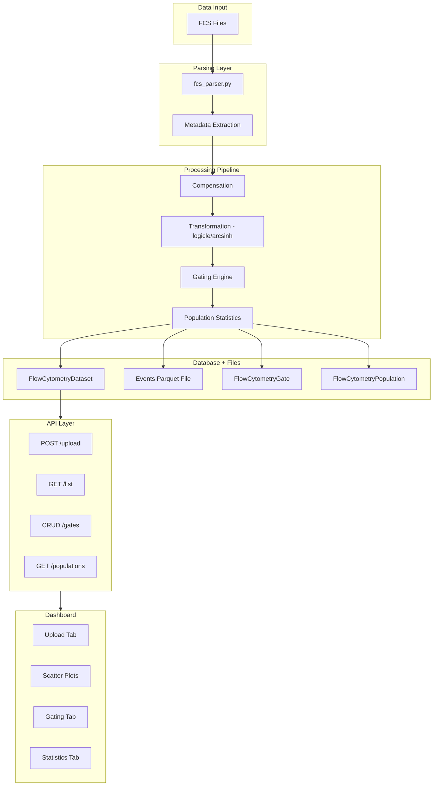

# Flow Cytometry / FACS Data Ingestion

**Status:** Approved with changes (Reviewer feedback incorporated)
**Created:** 2025-12-30
**Estimated Duration:** 5-7 days

## Overview

Implement comprehensive Flow Cytometry support following the established single-cell omics pattern in `amprenta_rag/single_cell/`.

## Architecture



## Reviewer Feedback (Incorporated)

### P1 Fixes Applied
1. **Event Storage:** Use Parquet files instead of database rows (10K-10M events/sample)
2. **Ellipse Gate:** Removed from MVP; polygon/rectangle/quadrant sufficient
3. **WSP Import:** Removed from scope; defer to future sprint
4. **Parameter Constraint:** Added unique constraint on (flow_dataset_id, parameter_index)

### P2 Additions
1. Boolean gates support (AND/OR combinations)
2. Arcsinh transform for CyTOF data
3. Subsample function for dashboard performance
4. Explicit pagination for events endpoint
5. PUT endpoint for gate updates

---

## Batch 1: Database Schema (Day 1)

**Files to create:**
- `amprenta_rag/database/models_flow_cytometry.py`

**Models:**

```python
class FlowCytometryDataset(Base):
    """Flow cytometry dataset metadata linked to a Dataset."""
    __tablename__ = "flow_cytometry_datasets"
    
    id: UUID (PK)
    dataset_id: UUID (FK to datasets.id)
    fcs_path: String(500)
    events_parquet_path: String(500)  # P1 FIX: Parquet storage for events
    file_size_bytes: BigInteger
    n_events: Integer
    n_parameters: Integer
    cytometer: String(200)  # BD FACSAria, etc.
    acquisition_date: DateTime
    compensation_matrix: JSON  # spillover matrix
    is_compensated: Boolean
    processing_status: String(50)  # pending/running/completed/failed
    processing_log: Text
    ingested_at: DateTime
    processed_at: DateTime

class FlowCytometryParameter(Base):
    """Parameter/channel metadata for a flow cytometry dataset."""
    __tablename__ = "flow_cytometry_parameters"
    
    id: UUID (PK)
    flow_dataset_id: UUID (FK)
    parameter_index: Integer  # 0-based channel index
    short_name: String(100)   # e.g., "FITC-A"
    long_name: String(200)    # e.g., "CD4 FITC-A"
    pnn: String(100)          # FCS $PnN
    pns: String(200)          # FCS $PnS
    range_value: Float        # FCS $PnR
    is_scatter: Boolean       # FSC/SSC vs fluorescence
    is_time: Boolean          # Time channel
    
    # P1 FIX: Unique constraint
    __table_args__ = (
        UniqueConstraint('flow_dataset_id', 'parameter_index', name='uq_flow_param_index'),
    )

class FlowCytometryGate(Base):
    """Gate definition for population identification."""
    __tablename__ = "flow_cytometry_gates"
    
    id: UUID (PK)
    flow_dataset_id: UUID (FK)
    name: String(200)
    gate_type: String(50)     # polygon, rectangle, quadrant (P1: removed ellipse)
    parent_gate_id: UUID (FK, nullable)  # hierarchical gating
    x_parameter: String(100)
    y_parameter: String(100)
    vertices: JSON            # [[x1,y1], [x2,y2], ...] for polygon
    bounds: JSON              # {x_min, x_max, y_min, y_max} for rect
    
    # P2: Boolean gate support
    boolean_operator: String(10)  # AND, OR, NOT (nullable)
    operand_gate_ids: ARRAY(UUID)  # gates to combine
    
    created_by_id: UUID (FK to users.id)
    created_at: DateTime
    updated_at: DateTime

class FlowCytometryPopulation(Base):
    """Gated population statistics."""
    __tablename__ = "flow_cytometry_populations"
    
    id: UUID (PK)
    flow_dataset_id: UUID (FK)
    gate_id: UUID (FK to gates)
    name: String(200)
    n_events: Integer
    pct_of_parent: Float
    pct_of_total: Float
    median_values: JSON       # {param: median} for each channel
    mean_values: JSON
    cv_values: JSON           # coefficient of variation
```

**Alembic migration:** Create all 4 tables with indexes.

**Tests (10):**
- Model creation and relationships
- Unique constraint enforcement
- JSON field serialization
- FK cascade behavior
- Boolean gate field validation

---

## Batch 2: FCS Parser & Transformation (Day 2)

**Files to create:**
- `amprenta_rag/flow_cytometry/__init__.py`
- `amprenta_rag/flow_cytometry/fcs_parser.py`
- `amprenta_rag/flow_cytometry/transforms.py`

**FCS Parser:**
```python
def load_fcs(path: str) -> Tuple[Dict, np.ndarray]:
    """Load FCS file using fcsparser, return (metadata, event_data)."""

def extract_metadata(meta: Dict) -> FlowMetadata:
    """Extract cytometer, date, parameters from FCS TEXT segment."""

def validate_fcs(path: str) -> List[str]:
    """Validate FCS file structure (2.0, 3.0, 3.1), return issues."""

def save_events_parquet(events: np.ndarray, param_names: List[str], path: str) -> None:
    """Save transformed events to Parquet file."""  # P1 FIX

def load_events_parquet(path: str) -> pd.DataFrame:
    """Load events from Parquet file."""  # P1 FIX
```

**Transformations:**
```python
def logicle_transform(data: np.ndarray, T: float, M: float, W: float, A: float) -> np.ndarray:
    """Logicle (biexponential) transformation for fluorescence data."""

def arcsinh_transform(data: np.ndarray, cofactor: float = 150) -> np.ndarray:
    """Arcsinh transformation for CyTOF data."""  # P2 ADD

def apply_compensation(data: np.ndarray, spillover: np.ndarray) -> np.ndarray:
    """Apply compensation matrix to correct spectral spillover."""

def auto_logicle_params(data: np.ndarray) -> Tuple[float, float, float, float]:
    """Estimate optimal logicle parameters with bounds validation."""
    # P2: Add bounds checking (T>0, M>0, 0<W<M/2, A>=0)

def subsample_events(events: np.ndarray, max_events: int = 50000) -> np.ndarray:
    """Random subsample for visualization performance."""  # P2 ADD
```

**Dependencies:** Add `fcsparser>=0.2.0` and `pyarrow>=14.0.0` to requirements.txt

**Tests (14):**
- FCS 2.0, 3.0, 3.1 format parsing
- Metadata extraction
- Logicle parameter bounds validation
- Arcsinh transform correctness
- Compensation matrix inversion
- Parquet save/load round-trip
- Subsample randomness and size

---

## Batch 3: Gating Engine & Ingest Service (Day 3)

**Files to create:**
- `amprenta_rag/flow_cytometry/gating.py`
- `amprenta_rag/flow_cytometry/ingest_service.py`

**Gating Engine:**
```python
def apply_polygon_gate(events: np.ndarray, x_idx: int, y_idx: int, 
                       vertices: List[Tuple]) -> np.ndarray:
    """Return boolean mask for events inside polygon gate."""

def apply_rectangle_gate(events: np.ndarray, x_idx: int, y_idx: int, 
                         bounds: Dict) -> np.ndarray:
    """Return boolean mask for events inside rectangle gate."""

def apply_quadrant_gate(events: np.ndarray, x_idx: int, y_idx: int, 
                        x_thresh: float, y_thresh: float) -> Dict[str, np.ndarray]:
    """Return dict of masks for Q1, Q2, Q3, Q4."""

def apply_boolean_gate(masks: Dict[UUID, np.ndarray], operator: str, 
                       operand_ids: List[UUID]) -> np.ndarray:
    """Combine gates with AND/OR/NOT."""  # P2 ADD

def compute_population_stats(events: np.ndarray, mask: np.ndarray, 
                             param_names: List[str]) -> PopulationStats:
    """Compute median, mean, CV for gated population."""
```

**Ingest Service:**
```python
def ingest_fcs(fcs_path: str, dataset_id: UUID | None = None) -> FlowCytometryDataset:
    """Create FlowCytometryDataset row and start background processing."""

def _process_fcs_async(flow_dataset_id: UUID) -> None:
    """Background: parse FCS, extract params, apply transforms, save Parquet."""

def apply_gate_to_dataset(flow_dataset_id: UUID, 
                          gate_definition: GateCreate) -> FlowCytometryGate:
    """Create gate and compute population statistics."""

def recompute_populations(flow_dataset_id: UUID) -> None:
    """Recompute all population stats after gate changes."""
```

**Tests (12):**
- Polygon gate with various vertex counts (3, 10, 100+)
- Rectangle gate edge cases
- Quadrant gate correct assignment
- Boolean gate AND/OR/NOT combinations
- Empty population handling (0 events in gate)
- Population stats accuracy
- Hierarchical gating

---

## Batch 4: API Endpoints (Day 4)

**Files to create:**
- `amprenta_rag/api/routers/flow_cytometry.py`
- `amprenta_rag/api/schemas/flow_cytometry.py`

**Endpoints (9 total):**

| Method | Path | Description |
|--------|------|-------------|
| POST | `/api/v1/flow-cytometry/upload` | Upload FCS file |
| GET | `/api/v1/flow-cytometry/datasets` | List flow datasets |
| GET | `/api/v1/flow-cytometry/datasets/{id}` | Get dataset details |
| GET | `/api/v1/flow-cytometry/datasets/{id}/events` | Get events (paginated) |
| POST | `/api/v1/flow-cytometry/datasets/{id}/gates` | Create gate |
| GET | `/api/v1/flow-cytometry/datasets/{id}/gates` | List gates |
| PUT | `/api/v1/flow-cytometry/gates/{gate_id}` | Update gate (P2 ADD) |
| DELETE | `/api/v1/flow-cytometry/gates/{gate_id}` | Delete gate |
| GET | `/api/v1/flow-cytometry/datasets/{id}/populations` | Get population stats |

**Schemas:**
```python
class EventsQueryParams(BaseModel):  # P2 ADD
    offset: int = 0
    limit: int = Field(default=10000, le=100000)
    parameters: Optional[List[str]] = None  # filter columns
    subsample: bool = True  # apply subsampling

class GateCreate(BaseModel):
    name: str
    gate_type: Literal["polygon", "rectangle", "quadrant"]
    parent_gate_id: Optional[UUID] = None
    x_parameter: str
    y_parameter: str
    vertices: Optional[List[List[float]]] = None
    bounds: Optional[Dict[str, float]] = None
    boolean_operator: Optional[Literal["AND", "OR", "NOT"]] = None
    operand_gate_ids: Optional[List[UUID]] = None

class GateUpdate(BaseModel):  # P2 ADD
    name: Optional[str] = None
    vertices: Optional[List[List[float]]] = None
    bounds: Optional[Dict[str, float]] = None
```

**Register router in `amprenta_rag/api/main.py`**

**Tests (10):**
- Upload endpoint with valid/invalid FCS
- Dataset list with filters
- Events pagination and subsampling
- Gate CRUD operations
- Gate update endpoint
- Population stats response

---

## Batch 5: Dashboard UI (Days 5-6)

**Files to create:**
- `scripts/dashboard/pages/flow_cytometry.py`

**4-Tab Dashboard:**

### Tab 1: Upload
- FCS file uploader (drag-and-drop)
- Metadata preview (cytometer, date, parameters)
- Processing status indicator
- Link to existing Dataset (optional)

### Tab 2: Scatter Plots
- X/Y parameter dropdowns
- Plotly 2D scatter (subsampled to 50K for performance)
- Transformation selector (linear, log, logicle, arcsinh)
- Density coloring option (hexbin)
- Gate overlay visualization

### Tab 3: Gating
- Draw polygon/rectangle gates on scatter plot
- Quadrant gate tool
- Hierarchical gate tree view
- Boolean gate builder (AND/OR combinations)
- Gate population preview
- Save/delete/update gates

### Tab 4: Statistics
- Population table (name, count, % parent, % total)
- Per-population channel statistics (MFI, CV)
- Export to CSV
- Summary plots (population hierarchy, pie chart)

**Register page in `scripts/dashboard/config/navigation.py`** under Analysis category.

**Tests (8):**
- Page load and navigation
- FCS upload workflow
- Scatter plot rendering
- Gate creation via UI
- Population table display
- CSV export functionality

---

## Batch 6: Integration & Documentation (Day 7)

**Tasks:**
1. Integration with existing Dataset model (omics_type="flow_cytometry")
2. Feature linking for marker channels
3. Seed script: `scripts/seed_flow_cytometry_data.py`
4. Documentation: `docs/FLOW_CYTOMETRY.md`
5. Update `docs/ROADMAP.md` to mark complete

**Seed Script:**
- Generate synthetic FCS-like data (10K events, 12 parameters)
- Create sample gates (lymphocyte, CD4+, CD8+)
- Populate populations with realistic stats

**Documentation:**
- FCS file requirements
- Transformation guide
- Gating workflow
- API reference

**Tests (6):**
- End-to-end ingestion workflow
- Feature linking verification
- Dataset relationship integrity
- Seed script idempotency

---

## Dependencies

Add to `requirements.txt`:
```
fcsparser>=0.2.0
pyarrow>=14.0.0
```

---

## Summary

| Batch | Deliverable | Files | Tests |
|-------|-------------|-------|-------|
| 1 | Database Schema | 1 + migration | 10 |
| 2 | FCS Parser & Transforms | 3 | 14 |
| 3 | Gating Engine & Ingest | 2 | 12 |
| 4 | API Endpoints | 2 | 10 |
| 5 | Dashboard UI | 1 | 8 |
| 6 | Integration & Docs | 3 | 6 |
| **Total** | | **12 files** | **60 tests** |

**Estimated Duration:** 5-7 days
**Test Coverage Target:** 100% pass rate, zero skipped tests (No Bandaids policy)

---

## Deferred Items (P3)

- FlowJo WSP workspace import
- Ellipse gates
- Automated gating (FlowSOM, t-SNE)
- FCS 3.2 support
- Multi-file batch upload
- Gate templates

