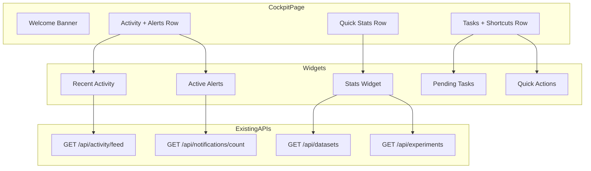

# Scientist's Cockpit

Dashboard

## Overview

Create a unified homepage dashboard that serves as the scientist's daily starting point. Displays widgets for recent activity, alerts, pending tasks, and quick actions to streamline daily workflow.

## Rationale (Dealer's Choice)

This feature was selected because:

- High user visibility and daily impact

- Leverages existing APIs (activity feed, notifications, datasets, experiments)

- Improves platform stickiness and workflow efficiency
- Reasonable scope with clear deliverables
- Complements all recently built features

## Existing Code to Leverage

- [scripts/dashboard/pages/activity_feed.py](scripts/dashboard/pages/activity_feed.py) - Activity event display patterns

- [amprenta_rag/api/routers/activity.py](amprenta_rag/api/routers/activity.py) - Activity API (includes /feed and /notifications/count)

- [amprenta_rag/api/routers/notifications.py](amprenta_rag/api/routers/notifications.py) - Notifications API

- [scripts/dashboard/core/config.py](scripts/dashboard/core/config.py) - Page registration

## Architecture

## Batches

### Batch 1: Widget Components

Files to create:

- `scripts/dashboard/components/cockpit_widgets.py`

Widgets to implement:

- `render_stats_widget()` - Counts for datasets, experiments, compounds, signatures

- `render_activity_widget()` - Last 5 activity events with timestamps

- `render_alerts_widget()` - Unread notifications with severity badges

- `render_tasks_widget()` - Pending reviews/approvals
- `render_shortcuts_widget()` - Quick action buttons (New Experiment, Upload Data, etc.)

Each widget: title, content area, "View All" link

### Batch 2: Dashboard Page

Files to create:

- `scripts/dashboard/pages/cockpit.py`

Register in: `scripts/dashboard/core/config.py` as default landing pageLayout:

- Welcome banner with user name and date

- 4-column stats row (datasets, experiments, compounds, signatures)

- 2-column row: Recent Activity (left), Alerts (right)

- 2-column row: Pending Tasks (left), Quick Actions (right)
- Responsive design using st.columns()

### Batch 3: Tests

Files to create:

- `amprenta_rag/tests/dashboard/test_cockpit_widgets.py` (8 unit tests)

- `amprenta_rag/tests/e2e/test_cockpit_page.py` (6 E2E tests)

Test coverage:

- Each widget renders without error
- Dashboard page loads with all widgets

- Stats display correctly

- Quick action buttons exist

- Activity and alerts sections render

## Success Criteria

- Cockpit loads as default landing page

- All 5 widgets display data correctly
- Quick actions navigate to correct pages
- 14+ tests passing
- Zero skipped tests
- No P3 deferrals

## Dependencies

- Existing: Activity API, Notifications API, Dataset/Experiment models
- No new packages required

- No new API endpoints needed (existing endpoints sufficient)

## Estimated Effort

- Batch 1: 2-3 hours (widgets)
- Batch 2: 2-3 hours (dashboard page)

- Batch 3: 2-3 hours (tests)