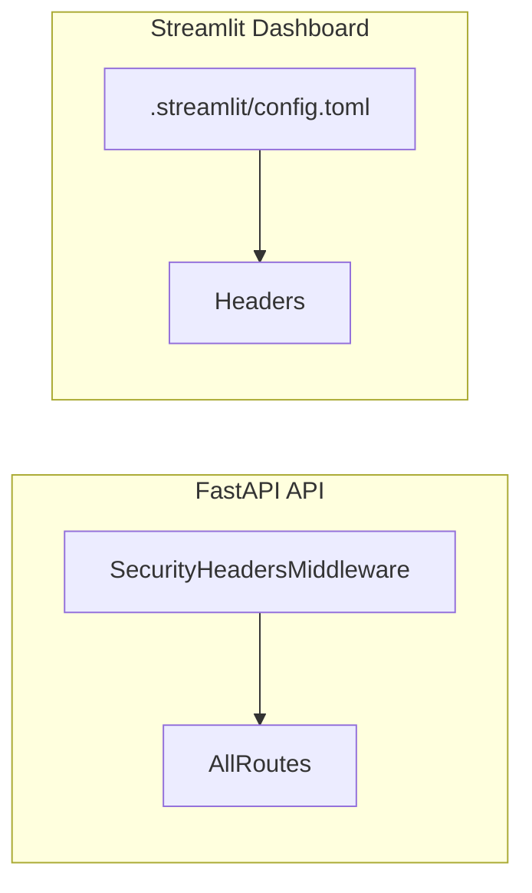

# Security Headers Implementation

Complete the security hardening sprint by adding HTTP security headers to both FastAPI API and Streamlit dashboard.

## Scope

| Header | Purpose | Value |
|--------|---------|-------|
| Content-Security-Policy | Prevent XSS | `default-src 'self'; script-src 'self' 'unsafe-inline' 'unsafe-eval'; style-src 'self' 'unsafe-inline'; img-src 'self' data: blob:; connect-src 'self' *` |
| Strict-Transport-Security | Force HTTPS | `max-age=31536000; includeSubDomains` |
| X-Frame-Options | Prevent clickjacking | `SAMEORIGIN` |
| X-Content-Type-Options | Prevent MIME sniffing | `nosniff` |
| Referrer-Policy | Control referrer info | `strict-origin-when-cross-origin` |
| Permissions-Policy | Restrict browser features | `geolocation=(), microphone=(), camera=()` |

## Architecture

## Implementation

### Batch 1: FastAPI Security Headers Middleware
- Add `SecurityHeadersMiddleware` to [`amprenta_rag/api/middleware.py`](amprenta_rag/api/middleware.py)
- Register in [`amprenta_rag/api/main.py`](amprenta_rag/api/main.py) (after CORS)
- Environment-aware: Skip HSTS in dev mode
- 4 tests for header presence

### Batch 2: Streamlit Configuration
- Update [`.streamlit/config.toml`](.streamlit/config.toml) with `server.enableXsrfProtection`
- Add CSP meta tag via custom HTML component
- 2 tests for Streamlit headers

### Batch 3: Documentation and Finalization
- Update [`docs/SECURITY.md`](docs/SECURITY.md) to mark headers as implemented
- Update ROADMAP to mark Security Headers complete
- Final test suite run

## Key Files

| File | Changes |
|------|---------|
| `amprenta_rag/api/middleware.py` | Add SecurityHeadersMiddleware |
| `amprenta_rag/api/main.py` | Register middleware |
| `.streamlit/config.toml` | Enable XSRF protection |
| `amprenta_rag/tests/security/test_security_headers.py` | New test file |
| `docs/SECURITY.md` | Update documentation |

## CSP Considerations

Streamlit requires relaxed CSP due to:
- Inline scripts for component rendering
- Inline styles for theming
- WebSocket connections for live updates
- Blob URLs for file downloads

We'll use a permissive but still protective policy.

## Effort

- **Estimated**: 3-5 days
- **Batches**: 3
- **Tests**: ~6 new tests

