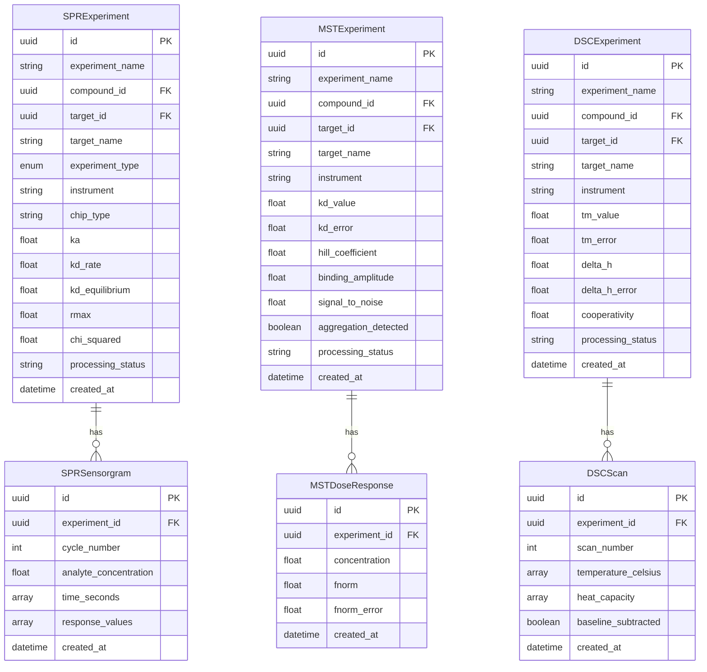

# Biophysical Assay Support

## Overview

The Amprenta platform provides comprehensive support for biophysical assay data analysis across three major techniques:

- **SPR (Surface Plasmon Resonance)**: Real-time binding kinetics and affinity measurements
- **MST (MicroScale Thermophoresis)**: Binding affinity determination using thermophoretic mobility
- **DSC (Differential Scanning Calorimetry)**: Protein thermal stability and unfolding analysis

This feature enables researchers to upload, analyze, and visualize biophysical data from major instrument platforms, with automated parameter extraction and cross-assay comparison capabilities.

## Supported Instruments & Formats

### SPR (Surface Plasmon Resonance)

| Instrument | Manufacturer | File Formats | Notes |
|------------|--------------|--------------|-------|
| Biacore T200 | Cytiva | CSV, TXT | Standard sensorgram export |
| Biacore 8K | Cytiva | CSV, TXT | Multi-channel data supported |
| Biacore S200 | Cytiva | CSV, TXT | Legacy format compatibility |
| SR7500DC | Reichert | CSV | Custom export format |

**Required Columns:**
- `Time` (seconds)
- `Response` (RU - Response Units)
- `Cycle` (injection cycle number)
- `Concentration` (analyte concentration)

### MST (MicroScale Thermophoresis)

| Instrument | Manufacturer | File Formats | Notes |
|------------|--------------|--------------|-------|
| Monolith NT.115 | NanoTemper | XLSX, CSV | Standard dose-response export |
| Monolith NT.Automated | NanoTemper | XLSX, CSV | High-throughput format |
| Monolith NT.LabelFree | NanoTemper | XLSX, CSV | Label-free measurements |

**Required Columns:**
- `Concentration` (M - Molar concentration)
- `Fnorm` (‰ - Normalized fluorescence)
- `Fnorm_Error` (optional - measurement error)

### DSC (Differential Scanning Calorimetry)

| Instrument | Manufacturer | File Formats | Notes |
|------------|--------------|--------------|-------|
| VP-DSC | MicroCal/Malvern | CSV | Standard thermogram export |
| Auto-iTC200 | MicroCal/Malvern | CSV | Automated sample handling |
| Nano DSC | TA Instruments | TXT, CSV | High-sensitivity measurements |

**Required Columns:**
- `Temperature` (°C - Celsius)
- `Cp` (kcal/mol/°C - Heat capacity)

## Data Models



## API Reference

### SPR Endpoints

#### Upload SPR File
```http
POST /api/v1/biophysical/spr/upload
Content-Type: multipart/form-data

{
  "file": <CSV/TXT file>,
  "experiment_id": "optional-uuid",
  "compound_id": "optional-uuid", 
  "target_id": "optional-uuid",
  "target_name": "optional-string"
}
```

**Response:**
```json
{
  "experiment_id": "uuid",
  "filename": "string",
  "file_size_bytes": 12345,
  "processing_status": "pending",
  "message": "SPR experiment created successfully"
}
```

#### List SPR Experiments
```http
GET /api/v1/biophysical/spr?compound_id=uuid&target_id=uuid&skip=0&limit=100
```

**Response:**
```json
[
  {
    "id": "uuid",
    "experiment_name": "string",
    "compound_id": "uuid",
    "target_id": "uuid", 
    "target_name": "string",
    "instrument": "Biacore T200",
    "chip_type": "CM5",
    "ka": 1.5e5,
    "kd_rate": 2.3e-3,
    "kd_equilibrium": 1.53e-8,
    "rmax": 150.0,
    "chi_squared": 1.25,
    "processing_status": "completed",
    "created_at": "2025-12-30T12:00:00Z"
  }
]
```

#### Get SPR Experiment
```http
GET /api/v1/biophysical/spr/{experiment_id}
```

#### Refit SPR Kinetics
```http
POST /api/v1/biophysical/spr/{experiment_id}/fit
Content-Type: application/json

{
  "model": "1:1_langmuir" | "two_state"
}
```

### MST Endpoints

#### Upload MST File
```http
POST /api/v1/biophysical/mst/upload
Content-Type: multipart/form-data

{
  "file": <XLSX/CSV file>,
  "experiment_id": "optional-uuid",
  "compound_id": "optional-uuid",
  "target_id": "optional-uuid", 
  "target_name": "optional-string"
}
```

#### List MST Experiments
```http
GET /api/v1/biophysical/mst?compound_id=uuid&target_id=uuid&skip=0&limit=100
```

#### Get MST Experiment
```http
GET /api/v1/biophysical/mst/{experiment_id}
```

#### Refit MST Affinity
```http
POST /api/v1/biophysical/mst/{experiment_id}/fit
Content-Type: application/json

{
  "model": "hill" | "langmuir"
}
```

### DSC Endpoints

#### Upload DSC File
```http
POST /api/v1/biophysical/dsc/upload
Content-Type: multipart/form-data

{
  "file": <CSV/TXT file>,
  "experiment_id": "optional-uuid",
  "compound_id": "optional-uuid",
  "protein_id": "optional-uuid",
  "protein_name": "optional-string"
}
```

#### List DSC Experiments
```http
GET /api/v1/biophysical/dsc?compound_id=uuid&protein_id=uuid&skip=0&limit=100
```

#### Get DSC Experiment
```http
GET /api/v1/biophysical/dsc/{experiment_id}
```

#### Refit DSC Thermal Analysis
```http
POST /api/v1/biophysical/dsc/{experiment_id}/fit
Content-Type: application/json

{
  "model": "two_state" | "three_state"
}
```

### Cross-Assay Endpoint

#### Compare Biophysical Results
```http
GET /api/v1/biophysical/compare?compound_id=uuid
```

**Response:**
```json
{
  "compound_id": "uuid",
  "spr_results": [...],
  "mst_results": [...], 
  "dsc_results": [...]
}
```

## Analysis Algorithms

### SPR Kinetic Analysis

#### 1:1 Langmuir Model
```
dR/dt = ka * C * (Rmax - R) - kd * R
```

Where:
- `ka`: Association rate constant (1/Ms)
- `kd`: Dissociation rate constant (1/s) 
- `KD`: Equilibrium dissociation constant = kd/ka (M)
- `Rmax`: Maximum binding capacity (RU)
- `C`: Analyte concentration (M)
- `R`: Response (RU)

#### Two-State Binding Model
```
A + B ⇌ AB ⇌ AB*
```

Accounts for conformational changes after initial binding.

**Quality Metrics:**
- `χ²`: Chi-squared goodness of fit (< 10% of Rmax is good)
- `SE`: Standard error of fitted parameters
- `Residuals`: Systematic deviations from model

### MST Affinity Analysis

#### Hill Equation
```
Fnorm = Fmin + (Fmax - Fmin) / (1 + (KD/C)^n)
```

Where:
- `KD`: Dissociation constant (M)
- `n`: Hill coefficient (cooperativity)
- `Fmin/Fmax`: Minimum/maximum normalized fluorescence
- `C`: Ligand concentration (M)

**Quality Metrics:**
- `R²`: Coefficient of determination (> 0.95 is excellent)
- `S/N Ratio`: Signal-to-noise ratio (> 5 is good)
- `Aggregation`: Detection based on Fnorm outliers

### DSC Thermal Analysis

#### Two-State Unfolding Model
```
N ⇌ D (Native ⇌ Denatured)
```

**Van't Hoff Equation:**
```
Cp = (ΔH²/RT²) * α * (1-α)
```

Where:
- `Tm`: Melting temperature (°C)
- `ΔH`: Enthalpy of unfolding (kcal/mol)
- `ΔCp`: Heat capacity change (kcal/mol/°C)
- `α`: Fraction unfolded
- `R`: Gas constant

**Quality Metrics:**
- `Cooperativity`: Sharpness of transition (1.5-2.0 is typical)
- `Reversibility`: Recovery after cooling (> 80% is good)
- `Baseline`: Pre/post-transition stability

## Dashboard Guide

### Accessing the Dashboard

1. Navigate to the Amprenta dashboard
2. Go to **Analysis** → **Biophysical Assays**
3. Select the appropriate tab for your assay type

### SPR Analysis Workflow

1. **File Upload**
   - Click "Upload Biacore/Reichert File"
   - Select CSV or TXT file from your instrument
   - Optionally link to compound and target
   - Click "Process SPR File"

2. **Sensorgram Visualization**
   - Select experiment from dropdown
   - View multi-concentration binding curves
   - Inspect association and dissociation phases
   - Check for mass transport limitations

3. **Kinetic Analysis**
   - Review fitted parameters (ka, kd, KD, Rmax)
   - Check chi-squared goodness of fit
   - Refit with different models if needed
   - Export results for reporting

### MST Analysis Workflow

1. **File Upload**
   - Click "Upload NanoTemper File" 
   - Select XLSX or CSV file
   - Link to compound and target
   - Click "Process MST File"

2. **Dose-Response Analysis**
   - Select experiment from dropdown
   - View log-scale concentration plot
   - Inspect Hill curve fitting
   - Check for aggregation artifacts

3. **Affinity Determination**
   - Review KD and Hill coefficient
   - Check signal-to-noise ratio
   - Assess data quality metrics
   - Refit with alternative models

### DSC Analysis Workflow

1. **File Upload**
   - Click "Upload MicroCal/TA File"
   - Select CSV or TXT thermogram
   - Link to protein target
   - Click "Process DSC File"

2. **Thermogram Analysis**
   - Select experiment from dropdown
   - View heat capacity vs temperature
   - Identify melting temperature (Tm)
   - Check baseline quality

3. **Thermal Stability**
   - Review Tm and ΔH values
   - Assess cooperativity index
   - Check reversibility if available
   - Compare across conditions

## Data Quality Guidelines

### SPR Quality Control

**Good Quality Indicators:**
- Smooth sensorgram curves without artifacts
- Clear association and dissociation phases
- χ² < 10% of Rmax
- Consistent kinetics across concentrations
- No significant mass transport effects

**Common Issues:**
- **Bulk effects**: Non-specific binding or refractive index changes
- **Mass transport**: Diffusion-limited binding (high ka, curved association)
- **Avidity**: Multiple binding sites causing complex kinetics
- **Aggregation**: Irregular binding curves or negative dissociation

### MST Quality Control

**Good Quality Indicators:**
- S/N ratio > 5
- R² > 0.95 for Hill fit
- Smooth dose-response curve
- No aggregation artifacts
- Consistent replicates

**Common Issues:**
- **Aggregation**: Sudden Fnorm changes at high concentrations
- **Adsorption**: Non-specific binding to capillary walls
- **Photobleaching**: Signal decay during measurement
- **Buffer effects**: Ionic strength or pH artifacts

### DSC Quality Control

**Good Quality Indicators:**
- Smooth baseline before and after transition
- Sharp, symmetric melting peak
- Reversibility > 80% (if applicable)
- Cooperativity 1.5-2.0
- Reproducible Tm values

**Common Issues:**
- **Aggregation**: Irreversible precipitation during heating
- **Degradation**: Proteolysis or chemical modification
- **Buffer artifacts**: pH changes or salt precipitation
- **Concentration effects**: Non-ideal behavior at high protein levels

## Troubleshooting

### File Upload Issues

**Problem**: "Invalid file format" error
**Solution**: 
- Verify file extension (.csv, .txt, .xlsx)
- Check column headers match required format
- Ensure data is properly formatted (no merged cells in Excel)

**Problem**: "Required columns not found"
**Solution**:
- SPR: Must have Time, Response, Cycle, Concentration
- MST: Must have Concentration, Fnorm
- DSC: Must have Temperature, Cp

### Analysis Problems

**Problem**: Fitting fails to converge
**Solutions**:
- Check data quality and remove outliers
- Try different starting parameters
- Use alternative fitting models
- Verify concentration units are correct

**Problem**: Unrealistic parameter values
**Solutions**:
- Check for systematic errors in data
- Verify experimental conditions
- Consider alternative binding models
- Review instrument calibration

### Performance Issues

**Problem**: Slow file processing
**Solutions**:
- Reduce file size by downsampling data
- Check server resources and database connection
- Monitor background processing status
- Contact system administrator if persistent

### API Integration

**Problem**: Authentication errors
**Solutions**:
- Verify API credentials are valid
- Check user permissions for biophysical module
- Ensure proper headers are included
- Review API documentation for changes

**Problem**: Timeout errors on large files
**Solutions**:
- Increase client timeout settings
- Split large datasets into smaller files
- Use asynchronous processing endpoints
- Monitor server performance

## Best Practices

### Experimental Design

1. **SPR Experiments**
   - Use appropriate concentration series (0.1-10x KD)
   - Include buffer-only controls
   - Regenerate surface between cycles
   - Monitor baseline stability

2. **MST Experiments**
   - Cover 2-3 orders of magnitude around KD
   - Include appropriate controls (buffer, competitor)
   - Use consistent labeling ratios
   - Check for aggregation at high concentrations

3. **DSC Experiments**
   - Use appropriate protein concentrations (0.1-1 mg/mL)
   - Include buffer-buffer baseline
   - Scan at appropriate rates (1°C/min typical)
   - Consider reversibility scans

### Data Management

1. **File Organization**
   - Use descriptive filenames with dates
   - Include experimental metadata in uploads
   - Link to relevant compounds and targets
   - Document buffer conditions and protocols

2. **Quality Control**
   - Review data quality metrics before analysis
   - Flag problematic experiments for review
   - Maintain experimental notebooks with details
   - Regular instrument calibration and maintenance

3. **Analysis Workflow**
   - Start with global fits across concentrations
   - Compare multiple binding models
   - Validate results with independent experiments
   - Document analysis parameters and decisions

## Integration with Other Modules

### Chemistry Module
- Automatic compound linking via SMILES/InChI
- Molecular weight and property calculations
- Structure-activity relationship analysis
- Chemical series comparison

### Protein Structure Module  
- Target protein sequence and structure data
- Binding site identification and analysis
- Homology modeling for unknown structures
- Druggability assessments

### Machine Learning Module
- Predictive models for binding affinity
- QSAR analysis using biophysical data
- Automated experiment optimization
- Anomaly detection in data quality

### Reporting Module
- Automated report generation
- Publication-quality figures
- Statistical analysis summaries
- Batch processing results

## References

1. **SPR Theory and Applications**
   - Rich, R.L. & Myszka, D.G. (2000) Nat. Biotechnol. 18, 1046-1050
   - Karlsson, R. (2004) J. Mol. Recognit. 17, 151-161

2. **MST Methodology**
   - Jerabek-Willemsen, M. et al. (2011) Assay Drug Dev. Technol. 9, 342-353
   - Seidel, S.A.I. et al. (2013) Methods 59, 301-315

3. **DSC Applications**
   - Freire, E. (1995) Annu. Rev. Biophys. Biomol. Struct. 24, 141-165
   - Bruylants, G. et al. (2005) Curr. Med. Chem. 12, 2011-2020

4. **Data Analysis**
   - Myszka, D.G. (1999) J. Mol. Recognit. 12, 279-284
   - Tellinghuisen, J. (2005) Anal. Biochem. 343, 106-115

---

*For additional support or feature requests, please contact the Amprenta development team or consult the API documentation at `/docs`.*
