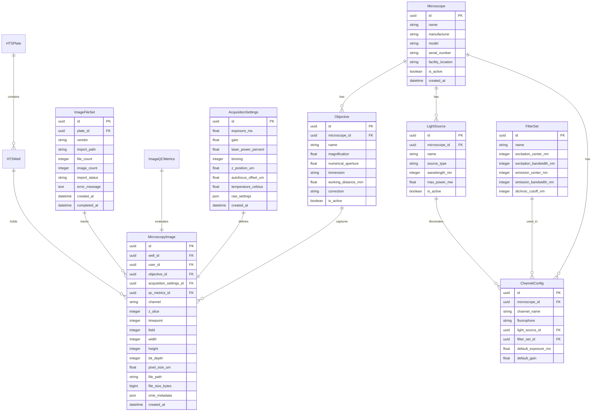

# Imaging Metadata & HCS Support

## Overview

The Amprenta RAG platform provides comprehensive support for microscopy imaging data and high-content screening (HCS) workflows. This feature enables researchers to:

- **Import and parse OME-TIFF files** with complete metadata extraction
- **Ingest multi-vendor HCS exports** from major instrument platforms
- **Manage instrument configurations** including microscopes, objectives, and channels
- **Perform automated image quality control** with focus, saturation, and artifact detection
- **Browse and analyze 5D imaging data** across plate, well, channel, Z-slice, and timepoint dimensions

## Supported Formats

### OME-TIFF (Open Microscopy Environment)

OME-TIFF is the standard format for microscopy metadata, providing rich structural information about imaging experiments.

**Supported Features:**
- Complete instrument metadata (microscope, objectives, light sources)
- Channel configurations (fluorophores, excitation/emission wavelengths)
- Dimensional information (X/Y/Z pixel sizes, channel count, timepoints)
- Acquisition parameters (exposure times, laser powers, temperatures)
- Multi-dimensional image stacks (5D: X, Y, Z, Channel, Time)

**Parser Implementation:**
- Uses `tifffile` library for TIFF reading
- Uses `ome-types` library for OME-XML schema validation
- Graceful handling of malformed or incomplete metadata
- Extracts both structured data and raw JSON for storage

### Vendor Export Formats

#### PerkinElmer Opera/Operetta

**Directory Structure:**
```
export_folder/
├── Index.xml              # Plate layout and well positions
├── Index.idx.xml          # Alternative format
└── Images/
    ├── r01c01f01p01-ch1sk1fk1fl1.tiff
    └── ...
```

**Filename Pattern:**
`r{row}c{col}f{field}p{plane}-ch{channel}sk{z}fk{frame}fl{timeline}.tiff`

**Metadata Sources:**
- Index.xml: Plate barcode, well layout, acquisition parameters
- Image filenames: Well positions, channels, Z-slices, timepoints
- TIFF headers: Image dimensions, bit depth, pixel sizes

#### Molecular Devices ImageXpress

**Directory Structure:**
```
export_folder/
├── experiment.htd         # Experiment definition
├── TimePoint_1/
│   ├── A01_s1_w1.TIF     # Well A01, site 1, wavelength 1
│   └── ...
└── TimePoint_2/
    └── ...
```

**Filename Pattern:**
`{well}_{site}_w{wavelength}.TIF`

**Metadata Sources:**
- HTD files: Experiment parameters, plate configuration
- Directory structure: Timepoint organization
- Image filenames: Well positions, field sites, wavelengths

#### Yokogawa Cell Voyager

**Directory Structure:**
```
export_folder/
├── MeasurementData.mlf    # Measurement log
├── MeasurementDetail.mrf  # Detailed parameters
└── Images/
    ├── W0001F0001T0001Z0001C1.flex
    └── ...
```

**Filename Pattern:**
`W{well}F{field}T{time}Z{z}C{channel}.flex`

**Metadata Sources:**
- MLF files: Measurement configuration, timing
- MRF files: Detailed acquisition settings
- FLEX format: Proprietary Yokogawa image format

## Data Models

The imaging metadata system uses 7 core database models to represent instrument configurations and image data:



### Key Relationships

1. **Microscope → Components**: Each microscope has multiple objectives, light sources, and channel configurations
2. **Image → Metadata**: Each image links to its acquisition settings, QC metrics, and instrument components
3. **Plate → Wells → Images**: HTS plate hierarchy for organizing screening data
4. **FileSet → Images**: Batch import tracking for vendor exports

## API Reference

The imaging system exposes 10 REST API endpoints for complete workflow management:

### Import Endpoints

#### `POST /imaging/import/ome-tiff`
Import single OME-TIFF file with metadata extraction.

**Request:**
```json
{
  "file_path": "/path/to/image.ome.tiff",
  "plate_id": "optional-plate-uuid",
  "well_position": "A01",
  "create_missing_well": true
}
```

**Response:**
```json
{
  "image_id": "uuid",
  "metadata_extracted": true,
  "qc_passed": true,
  "warnings": []
}
```

#### `POST /imaging/import/batch`
Import vendor export directory with auto-detection.

**Request:**
```json
{
  "import_path": "/path/to/export",
  "vendor": "opera",  // or null for auto-detection
  "plate_id": "optional-plate-uuid",
  "create_missing_wells": true
}
```

**Response:**
```json
{
  "fileset_id": "uuid",
  "vendor": "opera",
  "total_images": 1440,
  "status": "importing"
}
```

#### `GET /imaging/import/{fileset_id}/status`
Check import progress and status.

**Response:**
```json
{
  "fileset_id": "uuid",
  "status": "importing",
  "progress_percent": 65.5,
  "images_processed": 945,
  "total_images": 1440,
  "errors": [],
  "estimated_completion": "2024-01-15T10:30:00Z"
}
```

### Instrument Management

#### `GET /imaging/instruments`
List all registered microscopes with configurations.

**Response:**
```json
[
  {
    "id": "uuid",
    "name": "Nikon Ti2-E #1",
    "manufacturer": "Nikon",
    "model": "Ti2-E",
    "serial_number": "NK-001",
    "facility_location": "Lab A, Room 101",
    "is_active": true,
    "objectives": [...],
    "light_sources": [...],
    "channels": [...]
  }
]
```

#### `POST /imaging/instruments`
Register new microscope instrument.

**Request:**
```json
{
  "name": "Zeiss LSM 980",
  "manufacturer": "Zeiss",
  "model": "LSM 980",
  "serial_number": "ZS-LSM-001",
  "facility_location": "Confocal Core"
}
```

#### `GET /imaging/instruments/{id}`
Get detailed instrument configuration.

#### `GET /imaging/objectives`
List all available objectives across instruments.

#### `GET /imaging/channels`
List all configured channels across instruments.

### Quality Control

#### `GET /imaging/qc/image/{image_id}`
Get QC metrics for specific image.

**Response:**
```json
{
  "image_id": "uuid",
  "focus_score": 0.75,
  "saturation_percentage": 2.5,
  "uniformity_score": 0.85,
  "artifact_percentage": 1.2,
  "signal_noise_ratio": 25.3,
  "passed_qc": true,
  "issues": [],
  "analysis_timestamp": "2024-01-15T09:15:30Z"
}
```

### Data Browsing

#### `GET /imaging/browse`
Browse images with multi-dimensional filtering.

**Query Parameters:**
- `plate_id`: Filter by plate UUID
- `well_position`: Filter by well (e.g., "A01")
- `channel`: Filter by channel name
- `z_slice`: Filter by Z-slice index
- `timepoint`: Filter by timepoint index
- `passed_qc_only`: Show only QC-passed images
- `limit`: Page size (default 50)
- `offset`: Page offset

**Response:**
```json
{
  "images": [
    {
      "id": "uuid",
      "well_position": "A01",
      "channel": "DAPI",
      "z_slice": 0,
      "timepoint": 0,
      "field": 1,
      "width": 2048,
      "height": 2048,
      "pixel_size_um": 0.325,
      "file_path": "/storage/...",
      "qc_passed": true,
      "thumbnail_url": "/thumbnails/..."
    }
  ],
  "total_count": 1440,
  "page_info": {
    "limit": 50,
    "offset": 0,
    "has_next": true
  }
}
```

## Dashboard Guide

The imaging browser dashboard provides a comprehensive 4-tab interface for managing imaging workflows:

### Tab 1: Batch Import

**Purpose:** Import vendor export directories and OME-TIFF files

**Features:**
- **Directory Path Input**: Specify path to vendor export
- **Vendor Auto-Detection**: Automatically identify Opera, ImageXpress, or Cell Voyager formats
- **Plate Association**: Link imports to existing plates or create new ones
- **Progress Tracking**: Real-time import status with job monitoring
- **Error Reporting**: Detailed logs of import issues and warnings

**Supported Formats Info Panel:**
- Visual guide showing directory structures for each vendor
- File naming conventions and metadata sources
- Common troubleshooting tips

**Usage Flow:**
1. Enter export directory path
2. Select vendor format (or use auto-detection)
3. Configure plate association options
4. Monitor import progress
5. Review completion status and error logs

### Tab 2: 5D Browser

**Purpose:** Navigate and visualize multi-dimensional imaging data

**Dimensions:**
- **Plate**: Select from available plates
- **Well**: Filter by specific well positions (A01, B12, etc.)
- **Channel**: Multi-select from DAPI, GFP, RFP, Cy5, Brightfield
- **Z-slice**: Slider for focal plane navigation
- **Timepoint**: Slider for temporal series

**Features:**
- **Interactive Image Grid**: Thumbnail view with metadata overlays
- **QC Status Filtering**: Show only passed/failed images
- **Well Grid Visualization**: 96/384/1536-well plate layouts
- **Metadata Panel**: Detailed acquisition parameters per image
- **Full-Size Viewer**: Click thumbnails for detailed examination

**Navigation Controls:**
- Synchronized dimension sliders
- Quick-select buttons for common views
- Keyboard shortcuts for rapid browsing

### Tab 3: QC Dashboard

**Purpose:** Monitor and analyze image quality across plates

**Quality Metrics:**
- **Focus Scoring**: Laplacian, Brenner, and variance algorithms
- **Saturation Detection**: Pixel intensity distribution analysis
- **Illumination Uniformity**: Spatial intensity variation assessment
- **Artifact Detection**: Edge artifacts, dust, and debris identification

**Visualizations:**
- **Focus Heatmap**: Well-by-well focus quality visualization
- **QC Summary Cards**: Pass rates, average scores, issue counts
- **Issue Lists**: Specific wells with saturation or uniformity problems
- **Trend Analysis**: Quality metrics over time or batch

**Reporting Features:**
- **Plate QC Reports**: Comprehensive quality summaries
- **Recommendations**: Automated suggestions for protocol optimization
- **Export Options**: PDF reports and CSV data downloads

### Tab 4: Instruments

**Purpose:** Manage microscope configurations and hardware registry

**Microscope Registry:**
- **Instrument List**: All registered microscopes with status
- **Hardware Details**: Manufacturer, model, serial numbers
- **Location Tracking**: Facility and room assignments
- **Activity Status**: Active/inactive instrument management

**Configuration Management:**
- **Objective Library**: Magnification, NA, immersion specifications
- **Channel Configurations**: Fluorophore-filter-laser mappings
- **Light Source Registry**: Laser powers and wavelength specifications
- **Filter Set Database**: Excitation/emission filter characteristics

**Add New Instrument Form:**
- Required fields: Name, manufacturer, model
- Optional fields: Serial number, location
- Validation and duplicate checking
- Automatic activation upon registration

## QC Metrics

The image quality control system implements multiple algorithms for automated quality assessment:

### Focus Scoring Algorithms

#### Laplacian Variance
Measures image sharpness using second-derivative edge detection.
- **Range**: 0-1 (normalized)
- **Threshold**: > 0.3 for acceptable focus
- **Best for**: General-purpose focus assessment

#### Brenner Gradient
Evaluates focus using horizontal pixel intensity gradients.
- **Calculation**: Sum of squared differences between adjacent pixels
- **Sensitivity**: High sensitivity to horizontal edges
- **Best for**: Structured samples with clear boundaries

#### Intensity Variance
Measures overall pixel intensity distribution spread.
- **Metric**: Standard deviation of pixel intensities
- **Normalization**: Scaled by mean intensity
- **Best for**: Uniform samples with consistent staining

### Saturation Detection

**Algorithm**: Histogram analysis of pixel intensity distribution
- **High Saturation**: > 1% pixels at maximum intensity
- **Critical Saturation**: > 5% pixels saturated
- **Channels**: Independent analysis per fluorescence channel
- **Reporting**: Percentage of saturated pixels per channel

### Illumination Uniformity

**Method**: Radial intensity profile analysis
- **Center-to-Edge Ratio**: Compare center vs. edge intensities
- **Uniformity Score**: 1.0 = perfect uniformity, 0.0 = severe vignetting
- **Threshold**: > 0.4 for acceptable uniformity
- **Correction**: Flat-field correction recommendations

### Artifact Detection

**Edge Artifacts**:
- **Detection**: Intensity analysis at image borders
- **Common Causes**: Improper cropping, stage vibration
- **Threshold**: > 5% edge artifact content

**Dust and Debris**:
- **Method**: High-frequency noise analysis
- **Identification**: Isolated bright spots outside sample area
- **Filtering**: Size-based artifact classification

**Optical Artifacts**:
- **Newton's Rings**: Concentric intensity patterns
- **Chromatic Aberration**: Channel-specific distortions
- **Reporting**: Artifact percentage and classification

### QC Threshold Configuration

Default thresholds can be customized per instrument or experiment type:

```python
QC_THRESHOLDS = {
    "focus_score_min": 0.3,
    "saturation_percent_max": 5.0,
    "uniformity_score_min": 0.4,
    "artifact_percent_max": 8.0,
    "signal_noise_ratio_min": 5.0
}
```

## Troubleshooting

### Common Import Issues

#### OME-TIFF Files

**Issue**: "Invalid OME-XML schema"
- **Cause**: Malformed or incomplete XML metadata
- **Solution**: Use `validate_ome_schema()` function to identify specific errors
- **Workaround**: Enable graceful parsing mode to extract available metadata

**Issue**: "Missing instrument information"
- **Cause**: OME-XML lacks microscope/objective details
- **Solution**: Manually specify instrument configuration during import
- **Prevention**: Configure acquisition software to embed complete metadata

**Issue**: "Dimension mismatch errors"
- **Cause**: Image data doesn't match OME-XML dimension specifications
- **Solution**: Verify image stack organization and metadata consistency
- **Tool**: Use `extract_dimensions()` to validate size parameters

#### Vendor Exports

**Issue**: Opera export "Barcode not detected"
- **Cause**: Missing or malformed Index.xml file
- **Solution**: Verify Index.xml exists and contains `<PlateBarcode>` element
- **Alternative**: Use Index.idx.xml if available

**Issue**: ImageXpress "No images found"
- **Cause**: Incorrect TimePoint directory structure
- **Solution**: Check for TimePoint_1, TimePoint_2, etc. directories
- **File Pattern**: Ensure {Well}_{Site}_w{Wavelength}.TIF naming

**Issue**: Cell Voyager "MLF parsing failed"
- **Cause**: Corrupted or incomplete measurement log files
- **Solution**: Re-export from Cell Voyager software
- **Workaround**: Use directory-based parsing if MLF is unavailable

### QC Threshold Tuning

#### Focus Score Optimization

**Low Focus Scores on Good Images:**
- **Adjust**: Reduce `focus_score_min` threshold
- **Alternative**: Switch to Brenner algorithm for structured samples
- **Calibration**: Use known good/bad images to set thresholds

**High Focus Scores on Blurry Images:**
- **Issue**: Sample type not suited for Laplacian variance
- **Solution**: Use intensity variance algorithm for uniform samples
- **Custom**: Implement sample-specific focus metrics

#### Saturation Tuning

**False Positives (Good Images Flagged):**
- **Cause**: High dynamic range samples with legitimate bright regions
- **Solution**: Increase `saturation_percent_max` threshold
- **Alternative**: Use channel-specific thresholds

**False Negatives (Saturated Images Pass):**
- **Cause**: Threshold too permissive
- **Solution**: Reduce threshold or implement gradient-based detection
- **Validation**: Review histogram distributions for saturated samples

### Performance Optimization

#### Large Dataset Processing

**Slow Import Performance:**
- **Database**: Ensure proper indexing on `well_id`, `channel`, `z_slice`, `timepoint`
- **Storage**: Use fast SSD storage for image files
- **Parallel**: Enable multi-threaded import processing

**Memory Issues with Large Images:**
- **Streaming**: Use `read_ome_tiff_data()` for plane-by-plane processing
- **Chunking**: Process images in batches rather than loading entire datasets
- **Compression**: Use TIFF compression to reduce memory footprint

#### API Response Times

**Slow Browse Queries:**
- **Indexing**: Add composite indexes on frequently filtered columns
- **Pagination**: Use appropriate `limit` and `offset` parameters
- **Caching**: Implement Redis caching for frequent metadata queries

**Dashboard Loading Issues:**
- **Thumbnails**: Pre-generate thumbnail images during import
- **Lazy Loading**: Load image grids progressively
- **CDN**: Use content delivery network for static image assets

## Integration Examples

### Python SDK Usage

```python
from amprenta_rag.imaging import ome_parser, vendor_parsers, image_qc

# Parse OME-TIFF file
metadata = ome_parser.parse_ome_tiff("path/to/image.ome.tiff")
print(f"Image dimensions: {metadata.dimensions.size_x}x{metadata.dimensions.size_y}")
print(f"Channels: {[ch.name for ch in metadata.channels]}")

# Import vendor export
result = vendor_parsers.parse_vendor_export("path/to/opera/export")
print(f"Found {result.total_images} images from {result.vendor}")

# Run QC analysis
import numpy as np
image_data = np.random.randint(0, 4095, (1024, 1024), dtype=np.uint16)
qc_result = image_qc.run_image_qc(image_data)
print(f"Focus score: {qc_result.focus.score:.3f}")
print(f"QC passed: {qc_result.overall_pass}")
```

### API Integration

```python
import requests

# Start batch import
response = requests.post("http://localhost:8000/imaging/import/batch", json={
    "import_path": "/data/opera_export",
    "create_missing_wells": True
})
fileset_id = response.json()["fileset_id"]

# Monitor progress
status_response = requests.get(f"http://localhost:8000/imaging/import/{fileset_id}/status")
print(f"Progress: {status_response.json()['progress_percent']}%")

# Browse imported images
browse_response = requests.get("http://localhost:8000/imaging/browse", params={
    "channel": "DAPI",
    "passed_qc_only": True,
    "limit": 20
})
images = browse_response.json()["images"]
print(f"Found {len(images)} DAPI images passing QC")
```

### Database Queries

```sql
-- Find all images from a specific microscope
SELECT mi.*, w.well_position, p.barcode
FROM microscopy_images mi
JOIN hts_wells w ON mi.well_id = w.id
JOIN hts_plates p ON w.plate_id = p.id
JOIN objectives o ON mi.objective_id = o.id
JOIN microscopes m ON o.microscope_id = m.id
WHERE m.name = 'Nikon Ti2-E #1';

-- QC summary by plate
SELECT 
    p.barcode,
    COUNT(*) as total_images,
    SUM(CASE WHEN qc.passed_qc THEN 1 ELSE 0 END) as passed_count,
    AVG(qc.focus_score) as avg_focus,
    AVG(qc.saturation_percentage) as avg_saturation
FROM microscopy_images mi
JOIN hts_wells w ON mi.well_id = w.id
JOIN hts_plates p ON w.plate_id = p.id
JOIN image_qc_metrics qc ON mi.qc_metrics_id = qc.id
GROUP BY p.id, p.barcode;

-- Find images with specific QC issues
SELECT mi.*, w.well_position, qc.qc_issues
FROM microscopy_images mi
JOIN hts_wells w ON mi.well_id = w.id
JOIN image_qc_metrics qc ON mi.qc_metrics_id = qc.id
WHERE qc.passed_qc = false
AND qc.focus_score < 0.3;
```

## Future Enhancements

### Planned Features

1. **Advanced QC Algorithms**
   - Machine learning-based quality prediction
   - Content-aware focus metrics
   - Automated protocol optimization

2. **Extended Vendor Support**
   - BD Pathway integration
   - GE InCell integration
   - Custom format plugins

3. **Cloud Storage Integration**
   - AWS S3 image storage
   - Azure Blob integration
   - Google Cloud Storage support

4. **Real-time Processing**
   - Live acquisition monitoring
   - Streaming QC analysis
   - Alert system for quality issues

### API Roadmap

- **Batch Operations**: Bulk QC reprocessing, metadata updates
- **Advanced Filtering**: Complex multi-dimensional queries
- **Export Functions**: OMERO integration, ImageJ plugin support
- **Webhooks**: Real-time notifications for import completion

---

*For additional support or feature requests, please contact the development team or submit issues through the project repository.*
